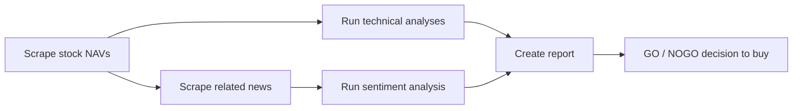
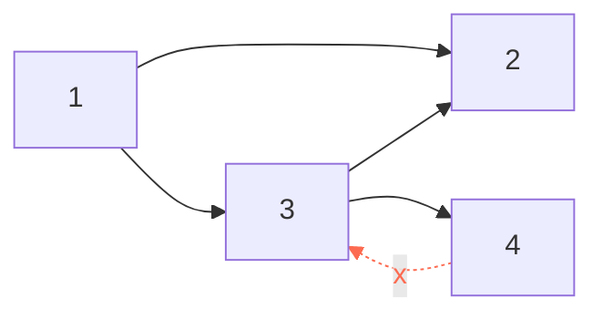

# Getting things done with <span class="dm-accent">Airflow</span>

<p class="mt-6 text-lg opacity-80"><code>github.com/datamindedacademy/workflows_with_airflow</code></p>

---
layout: default
label: Intro
---

# Who am <span class="dm-accent">I?</span>

<!--
<DmColumns class="mt-6">
<DmColumn header="Cedric Mingneau" tone="navy">

- Data Engineer, Data Minded (since 2022)
- Providing services for Luminus
- Previously: Data Engineer at Selligent Marketing Cloud (2021 – 2022)

</DmColumn>
</DmColumns>
-->

<DmColumns class="mt-6">
<DmColumn header="Jos Teunissen" tone="violet">

- Data Engineer, Data Minded (since 2023)
- Providing services for Luminus
- Before that: UGent (Centre for Molecular Modelling), Royal Belgian Institute for Space Aeronomy, VUB, Rijksuniversiteit Groningen

</DmColumn>
</DmColumns>

---
layout: agenda
label: Contents
---

# Contents

1. Orchestration
2. Architecture
3. The web UI
4. Building a DAG
5. Scheduling
6. Templating
7. DAG design patterns
8. Operators & trigger rules
9. Cross-DAG dependencies
10. Sharing data & configuration
11. Best practices
12. Wrap-up

---
layout: section
---

# <span class="dm-accent">Orchestration</span>

---
layout: default
label: 1 · Orchestration
---

# Why a scheduler? A workflow triggered at a <span class="dm-accent">definite time</span>



<p class="mt-8 text-lg">Run daily, at 08h, but not in the weekends.</p>

---
layout: default
label: 1 · Orchestration
---

# What is Airflow, and <span class="dm-accent">why?</span>

<div class="mt-4">

A workflow scheduler for batch jobs, originally built at Airbnb, now mostly maintained by Astronomer. **Airflow 3** is the current major version — this course runs 3.1.

</div>

<DmColumns class="mt-6" :gap="16">
<DmColumn tone="plain">

- Open-source automation of batch workflows
- Workflows are **Python code**, with its whole ecosystem available
- Kept in version control, deployed through CI/CD
- Extend it with your own operators, hooks and plugins

</DmColumn>
<DmColumn tone="plain" divider>

- Ready-made operators for Spark, SQL, Kubernetes, the big clouds, …
- A large community, so most problems are already answered somewhere
- A UI that tells you what ran, what failed, and how long it took

</DmColumn>
</DmColumns>

---
layout: cards
---

# The Airflow landscape: modern <span class="dm-accent">competitors</span>

<template #cards>
<DmCard header="Prefect" tone="violet">

**Developer-centric**

Dynamic, modern data stacks with native Python integration and less boilerplate.

- "Code as workflows"
- Dynamic task mapping
- Scalable hybrid-cloud agent model

</DmCard>
<DmCard header="Dagster" tone="navy">

**Data-asset centric**

Focuses on data assets rather than just tasks; strong local dev & testing.

- Built-in data lineage
- Rich UI for asset monitoring
- Software-defined assets

</DmCard>
<DmCard header="Argo Workflows" tone="violet" class="card-argo">

**Cloud-native (K8s)**

Open-source, container-native workflow engine as a Kubernetes CRD.

- Native Kubernetes execution
- YAML configuration
- Great for heavy ML/container jobs

</DmCard>
</template>

<p class="mt-6 text-center">Airflow 3 closed much of this gap — <b>Assets</b> answer software-defined assets, and the <b>Task SDK</b> answers the developer-experience critique. Also worth knowing: Kestra, Temporal, Flyte.</p>

---
layout: statement
---

# How would you automate a sequence of <span class="dm-accent">tasks?</span>

<p class="mt-6 text-lg opacity-90">Take a minute. What has to be true before a step may start?</p>

---
layout: default
label: 1 · Orchestration
---

# Directed Acyclic Graphs allow <span class="dm-accent">ordering</span>

<div class="flex justify-center mt-2">



</div>

<p class="mt-4 text-lg">Valid execution orders for this DAG, with edges meaning "before":</p>

<DmColumns class="mt-4">
<DmColumn tone="plain">

**1 → 3 → 2 → 4**

</DmColumn>
<DmColumn tone="plain" divider>

**1 → 3 → 4 → 2**

</DmColumn>
</DmColumns>

<div class="flex justify-center mt-6">
<DmBanner tone="authentic" icon="i-mdi-close-circle-outline" title="Not acyclic? Not allowed.">
Cycles have no valid execution order.
</DmBanner>
</div>

---
layout: default
label: 1 · Orchestration
---

# A workflow describes the <span class="dm-accent">what</span>, not the how

<DmProcess class="mt-6">
<DmPhase label="Uploaded file to FTP" />
<DmPhase label="Retrieve file from server" />
<DmPhase label="Process the data" />
<DmPhase label="Store in internal storage" />
<DmPhase label="Send report" />
</DmProcess>

<DmColumns class="mt-8" :gap="16">
<DmColumn tone="plain">

- **Steps**, in a defined **order**
- A **graph**: entities with relationships — nodes & edges
- **Direction** between the nodes

</DmColumn>
<DmColumn tone="plain" divider>

- **Acyclic**: no revisiting nodes
- Stays **high-level**: it describes the *what*, not the *how*

</DmColumn>
</DmColumns>

---
layout: default
label: 1 · Orchestration
---

# Example DAG in Airflow with 5 <span class="dm-accent">tasks</span>

<div class="flex justify-center mt-6">

</div>

---
layout: default
label: 1 · Orchestration
---

# Tasks come in all shapes and <span class="dm-accent">sizes</span>

<DmColumns class="mt-6" :gap="16">
<DmColumn tone="plain">

- Train a model on a GPU
- Query an API
- Execute a Spark job
- Execute ML inference
- Load, clean and store a dataframe
- Read from an API and store in a bucket

</DmColumn>
<DmColumn tone="plain" divider>

- Read from a bucket and store in Snowflake
- Create a PDF
- Execute SQL on Snowflake
- Send an email
- Call GPT-4
- Run a Docker container
- Join 2 parquet tables and aggregate

</DmColumn>
</DmColumns>

---
layout: statement
---

# Exercise 0

<div class="ex-grid ex-grid--single">
<div class="ex-item">
<p class="ex-name">0 · hello airflow</p>
<p class="ex-desc">Intro to the Airflow UI and running your first DAG</p>
<p class="exercise-path"><code>0_hello_airflow</code></p>
</div>
</div>

<!--
DEBUG ISSUES: you might have to strip the `next` parameter from your forwarder URL, e.g.
https://.../api/v2/auth/login?next=https%3A%2F%2F...
-->

---
layout: section
---

# <span class="dm-accent">Architecture</span>

---
layout: default
label: 2 · Architecture
---

# Why Airflow <span class="dm-accent">3?</span>

<DmColumns class="mt-6" :gap="16">
<DmColumn tone="plain">

- **Decoupled architecture** — the Task SDK means workers no longer need full DAG file access
- **Performance boost** — removes "parsing loop" bottlenecks for near-instant task startup
- **Massive scalability** — designed for millions of daily tasks with a lighter footprint

</DmColumn>
<DmColumn tone="plain" divider>

- **Data-first design** — first-class support for Data Assets and event-driven scheduling
- **Enhanced DevEx** — a modernized UI and improved local development experience

</DmColumn>
</DmColumns>

---
layout: default
label: 2 · Architecture
---

# Airflow 2 vs. Airflow <span class="dm-accent">3</span>

<DmColumns class="mt-4" :gap="16">
<DmColumn header="Airflow 2" tone="navy">


</DmColumn>
<DmColumn header="Airflow 3" tone="violet" divider>


</DmColumn>
</DmColumns>

<DmBanner tone="violet" icon="i-mdi-shield-lock-outline" class="mt-6">
In Airflow 3, user-defined code no longer has direct access to the metadata database — everything goes through the API server / Task SDK.
</DmBanner>

---
layout: default
label: 2 · Architecture
---

# The components you actually <span class="dm-accent">deploy</span>

<DmColumns class="mt-4" :gap="16">
<DmColumn tone="plain">

- **API server** — serves the REST API *and* the UI. Called the *webserver* in Airflow 2
- **DAG processor** — parses your DAG files. A **required, standalone** process in Airflow 3, so the scheduler never touches your code
- **Scheduler** — decides which task instances may run, and hands them to the executor

</DmColumn>
<DmColumn tone="plain" divider>

- **Executor** — starts workers: Local, Celery, Kubernetes, Edge
- **Workers** — run the tasks, possibly on other machines
- **Triggerer** — *optional*; runs deferred tasks in an asyncio loop (see section 9)
- **Metadata database** — task status, runtime, configuration, …

</DmColumn>
</DmColumns>

<DmBanner tone="authentic" icon="i-mdi-alert-outline" class="mt-6">
Keep the DAG processor cheap. It re-parses every DAG file on a loop, so anything expensive at the top level of your file is paid over and over — see exercise 1.
</DmBanner>

<!--
Scheduler: process running on a server, delegates tasks to workers, shouldn't do any processing
work (though it technically can), needs to cycle through DAGs so shouldn't be "distracted".
Executor: defines the system that starts workers (celery, kubernetes, local). Local runs
sequentially, best for testing. Communication between scheduler and worker happens through a
messaging queue (e.g. Redis).
Worker: also a process, can run on different machines (like EC2 instances).
Metadata: used by the scheduler — were tasks successful, how long did they run, should other
tasks run given this info, etc.
-->

---
layout: default
label: 2 · Architecture
---

# Which of those you actually <span class="dm-accent">touch</span>

<DmColumns class="mt-6" :gap="16">
<DmColumn header="Authoring" tone="navy">

Write Python files into the **DAG bundle** — for us, a folder; in production usually a git repository the DAG processor syncs.

</DmColumn>
<DmColumn header="Operating" tone="violet" divider>

The **UI**, served by the API server and backed by the metadata database. Trigger, inspect, clear, backfill.

</DmColumn>
<DmColumn header="Rarely" tone="navy" divider>

Scheduler, executor and workers are infrastructure. The CLI and scheduler logs are for when something is genuinely wrong.

</DmColumn>
</DmColumns>

<DmBanner tone="violet" icon="i-mdi-source-branch" class="mt-8">
Airflow 3 tracks the <b>version</b> of the DAG each run used. A run finishes against the code it started with, even if you deploy mid-run — and the UI shows you which version that was.
</DmBanner>

---
layout: section
---

# The web <span class="dm-accent">UI</span>

---
layout: default
label: 3 · The web UI
---

# Web UI: DAGs <span class="dm-accent">view</span>

<div class="flex justify-center mt-4">

</div>

<!--
Important columns:
Owner — assigns owners to DAGs so only they can see and control them; "airflow" as owner
preserves a "see-all" view.
Runs (in order) — how many successful DAG runs, how many running right now, how many failures?
Recent Tasks — specific to task runs, also shows different states (skipped, retries, queued,
failed, etc.).
-->

---
layout: default
label: 3 · The web UI
---

# Web UI: grid <span class="dm-accent">view</span>

<div class="flex justify-center mt-4">

</div>

---
layout: default
label: 3 · The web UI
---

# Web UI: graph <span class="dm-accent">view</span>

<div class="flex justify-center mt-4">

</div>

<p class="mt-4 text-center text-lg">Great in development, because a picture says more than a thousand words (of Python 🐍).</p>

---
layout: default
label: 3 · The web UI
---

# Web UI: Gantt <span class="dm-accent">chart</span>

<div class="flex justify-center mt-4">

</div>

<div class="mt-4">

Good for observing the duration of a specific task run, and parallelism within a DAG (⚠️ parallelism is configurable). Less ideal for task dependencies — use the Graph tab for that.

</div>

---
layout: default
label: 3 · The web UI
---

# Web UI: calendar <span class="dm-accent">view</span>

<div class="flex justify-center mt-4">

</div>

---
layout: default
label: 3 · The web UI
---

# Web UI: code <span class="dm-accent">view</span>

<div class="mt-4">

A read-only view on the code behind the workflow — and in Airflow 3, on the **exact version each run used**, since a run completes against the code it started with.

</div>

<div class="flex justify-center mt-4">

</div>

<!--
Read-only view. "Has Airflow picked up my new changes?" It can take up to 30s before the
scheduler has updated the DAG code. Alternatively, you can also rename your DAG.
-->

---
layout: section
---

# Building a <span class="dm-accent">DAG</span>

---
layout: default
label: 4 · Building a DAG
---

# The anatomy of a DAG: schedule, tasks, <span class="dm-accent">operators</span>

<DmColumns class="mt-4" :gap="20">
<DmColumn tone="plain" class="col-w2">

- Each DAG has a schedule and a unique `dag_id`
- Each DAG has at least one task
- Each task belongs to a DAG and has a unique `task_id`
- Each task is an instance of an operator
- Tasks run only when all upstream tasks succeeded by default, but this is configurable via `trigger_rule` (e.g. `trigger_rule="one_failed"`)
- Many operator types exist: `BashOperator`, `PythonOperator`, `KubernetesPodOperator`, `SSHOperator`, … and you can make your own

</DmColumn>
<DmColumn tone="plain" divider class="col-w1">

```python
with DAG(dag_id="example", ...):
    BashOperator(
        task_id="example",
        bash_command="date",
        trigger_rule="all_success",
    )
```

</DmColumn>
</DmColumns>

---
layout: default
label: 4 · Building a DAG
---

# A workflow is defined by the DAG class and its <span class="dm-accent">operators</span>

```python {all|1-6|8-12}
with DAG(
    dag_id="reporting",
    schedule="@daily",
    start_date=pendulum.datetime(2026, 1, 1, tz="Europe/Brussels"),
    default_args={"retries": 1},  # passed to every operator, overridable per task
) as dag:
    retrieve = PythonOperator(task_id="retrieve", python_callable=retrieve_file)
    process = PythonOperator(task_id="process", python_callable=process_data)
    store = PythonOperator(task_id="store", python_callable=store_data)

    retrieve >> process >> store
```

<div class="mt-4">

`dag_id`s and `task_id`s must be unique so you can reference them (e.g. from an `ExternalTaskSensor`). 💡 Don't repeat strings all over the place — imagine fixing a typo. IDEs can autorename objects, but not standalone strings.

</div>

---
layout: default
label: 4 · Building a DAG
---

# The Python Operator executes a Python callable on a <span class="dm-accent">worker</span>

```python
import pendulum
from airflow.sdk import DAG
from airflow.providers.standard.operators.python import PythonOperator

def say_hello():
    print("Hello Airflow")
    return "this goes to xcom"

with DAG(
    dag_id="hello_airflow",
    schedule="@daily",
    start_date=pendulum.datetime(2026, 1, 1, tz="Europe/Brussels"),
) as dag:
    task = PythonOperator(
        task_id="hello_world",
        python_callable=say_hello,
    )
```

<p class="mt-4"><code>airflow.sdk</code> is the Airflow 3 public interface — the Task SDK. It is what workers get, and it is where <code>DAG</code>, <code>task</code>, <code>chain</code>, <code>Asset</code> and friends now live.</p>

---
layout: default
label: 4 · Building a DAG
---

<h1 class="tf-title">Two ways to write the same task: pick one, stay <span class="dm-accent">consistent</span></h1>

<DmColumns class="mt-1 code-compare" :gap="16">
<DmColumn header="Classic: PythonOperator" tone="navy">

```python
def extract():
    return {"value": 42}

with DAG(dag_id="example") as dag:
    task = PythonOperator(
        task_id="extract",
        python_callable=extract,
    )
```

</DmColumn>
<DmColumn header="TaskFlow API" tone="violet" divider>

```python
from airflow.sdk import dag, task

@dag(dag_id="example")
def example():
    @task
    def extract():
        return {"value": 42}

    extract()

example()
```

</DmColumn>
</DmColumns>

<DmBanner tone="authentic" icon="i-mdi-scale-balance" title="It is a trade-off, not a right answer" class="mt-1 tf-banner">
Mixing both in one repository is the only choice that is clearly wrong.
</DmBanner>

<div class="mt-1 tf-bullets">

- **For TaskFlow:** far less boilerplate; XComs are just return values and arguments; `.expand()` for dynamic mapping reads naturally; it is where Airflow 3's Task SDK is heading, and what the docs recommend
- **Against:** decorators are not beginner friendly; it looks unlike your other operators, so a mixed DAG reads inconsistently; the bare `extract()` on the last line suggests the scheduler runs your function, which is not what happens
- **Either way:** non-trivial Python belongs in a package you import, not in the DAG file

</div>

---
layout: default
label: 4 · Building a DAG
---

# For the record, the docs have a <span class="dm-accent">favourite</span>

<div class="flex justify-center mt-4">

</div>

<p class="mt-4 text-lg">This course uses the classic operator in most exercises because it makes the machinery visible — exercise 10 gives you both. Once you know what a decorator hides, choose deliberately for your own team.</p>

---
layout: statement
---

# Exercise 1

<div class="ex-grid ex-grid--single">
<div class="ex-item">
<p class="ex-name">1 · investing</p>
<p class="ex-desc">Top-level code cost — why heavy work at import time slows the scheduler</p>
<p class="exercise-path"><code>1_investing</code></p>
</div>
</div>

---
layout: section
---

# <span class="dm-accent">Scheduling</span>

---
layout: default
label: 5 · Scheduling
---

# Five ways to tell Airflow <span class="dm-accent">when to run</span>

<table class="dm-table mt-4">
<thead><tr><th>Method</th><th>Example</th></tr></thead>
<tbody>
<tr><td>Presets</td><td><code>None</code>, <code>@once</code>, <code>@hourly</code>, <code>@daily</code>, <code>@weekly</code>, <code>@monthly</code>, <code>@yearly</code></td></tr>
<tr><td>Cron syntax</td><td><code>*/5 1,2 * * *</code></td></tr>
<tr><td><code>datetime.timedelta</code></td><td><code>datetime.timedelta(days=4)</code></td></tr>
<tr><td>Timetable</td><td>a schedule object — the only way to get a <b>data interval</b>, or a fully custom calendar</td></tr>
<tr><td>Asset</td><td>each time another process updates an Asset</td></tr>
</tbody>
</table>

<p class="mt-6"><b>Every preset is just cron in disguise</b> — which is why they align to the start of a calendar unit:</p>

<DmColumns class="mt-3" :gap="16">
<DmColumn tone="plain">

- `@hourly` ≡ `0 * * * *`
- `@daily` ≡ `0 0 * * *`
- `@weekly` ≡ `0 0 * * 0` (Sunday 00:00)

</DmColumn>
<DmColumn tone="plain" divider>

- `@monthly` ≡ `0 0 1 * *`
- `@yearly` ≡ `0 0 1 1 *`
- `None` / `@once` have no cron equivalent

</DmColumn>
</DmColumns>

---
layout: default
label: 5 · Scheduling
---

# Airflow scheduling: <span class="dm-accent">cron</span> syntax

```
┌───────────── minute (0 - 59)
│ ┌───────────── hour (0 - 23)
│ │ ┌───────────── day of the month (1 - 31)
│ │ │ ┌───────────── month (1 - 12)
│ │ │ │ ┌───────────── day of the week (0 - 6) (0: Su, 6: Sa)
│ │ │ │ │
* * * * *
```

<p class="mt-4">Mnemonic: <b>Mi Ho Da Mo We</b>.</p>

<DmColumns class="mt-4" :gap="16">
<DmColumn tone="plain">

- `*/5 1,2,3 * * *` — every 5th minute of the 1st, 2nd and 3rd hour
- `*/5 1-3 * * *` — same as above

</DmColumn>
<DmColumn tone="plain" divider>

- `*/30 * * * 0` — every half hour on Sunday
- `0 8 * * 1-5` — 08h00, Monday through Friday

</DmColumn>
</DmColumns>

<p class="mt-4 text-lg">Use tools like <a href="https://crontab.guru">crontab.guru</a> to verify the expression matches your intent.</p>

<!--
The 6th field (if present) refers to seconds. If you need second-level triggers you probably want
a different tool/framework — that's near-real-time event processing (Kafka/Flink/Spark Streaming).
A cron job can't run "every 5 days" → use datetime.timedelta. Time has to be divisible by 5.
Timetables: complex, usually not needed — used when you can't regularly run your DAG (e.g. at
sunrise, which changes every day); refer to docs, defined in Python code.
Assets: whenever an asset is updated by a producing task.
-->

---
layout: default
label: 5 · Scheduling
---

# In Airflow 3, a cron schedule fires <span class="dm-accent">at</span> the cron time

<div class="mt-4">

Give `schedule` a cron string or a preset and you get a **`CronTriggerTimetable`**: the run fires the moment the cron expression matches. There is no window — `data_interval_start`, `data_interval_end` and `logical_date` are all the same instant.

</div>

```python
with DAG(dag_id="birthday", schedule="0 0 3 8 *",     # Mi Ho Da Mo We → 00:00 on 3 August
         start_date=pendulum.datetime(1987, 8, 3, tz="Europe/Brussels")):
    ...
```

<table class="dm-table mt-4">
<thead><tr><th>Run fires at</th><th><code>logical_date</code></th><th><code v-pre>{{ ds }}</code></th></tr></thead>
<tbody>
<tr><td>1987-08-03 00:00</td><td>1987-08-03 00:00</td><td>1987-08-03</td></tr>
<tr><td>1988-08-03 00:00</td><td>1988-08-03 00:00</td><td>1988-08-03</td></tr>
</tbody>
</table>

<DmBanner tone="violet" icon="i-mdi-alert-decagram-outline" class="mt-6">
This changed in Airflow 3: <code>create_cron_data_intervals</code> now defaults to <code>False</code>. In Airflow 2 the same DAG fired a year <b>later</b>, at the end of an interval.
</DmBanner>

---
layout: default
label: 5 · Scheduling
---

# Presets align to the calendar unit, not to your <span class="dm-accent">start_date</span>

<div class="mt-4">

Say you want a birthday DAG for someone born on **1987-08-03**, and you reach for `@yearly`:

</div>

```python
with DAG(dag_id="birthday", schedule="@yearly",
         start_date=pendulum.datetime(1987, 8, 3, tz="Europe/Brussels")):
    ...
```

<table class="dm-table mt-4">
<thead><tr><th></th><th><code>@yearly</code></th><th><code>0 0 3 8 *</code></th></tr></thead>
<tbody>
<tr><td><b>Cron it resolves to</b></td><td><code>0 0 1 1 *</code></td><td><code>0 0 3 8 *</code></td></tr>
<tr><td><b>Fires on</b></td><td>1 January ❌</td><td>3 August ✅</td></tr>
</tbody>
</table>

<DmBanner tone="authentic" icon="i-mdi-alert-outline" class="mt-6">
A preset never looks at your <code>start_date</code> — it only decides when the DAG may <b>start</b> firing. Write the cron out when you need a specific day.
</DmBanner>

---
layout: default
label: 5 · Scheduling
---

# Summarising a period? Opt in to a data <span class="dm-accent">interval</span>

<div class="mt-4">

Fine for "send the birthday mail". Not enough for "sum yesterday's revenue" — that needs a **window**. Pass a timetable explicitly: the run then fires at the **end** of its interval, with both edges templated.

</div>

```python
from airflow.timetables.interval import CronDataIntervalTimetable

with DAG(dag_id="daily_revenue",
         schedule=CronDataIntervalTimetable("0 0 * * *", "Europe/Brussels"),
         start_date=pendulum.datetime(2026, 1, 1, tz="Europe/Brussels")):
    ...
```

<div class="flex justify-center mt-4">

</div>

<p class="mt-2 text-sm opacity-80">The diagram's <i>execution date</i> is what Airflow 3 calls <code>logical_date</code> — with this timetable it is the interval <b>start</b>, so <code v-pre>{{ ds }}</code> is the day being summarised, not the day the DAG runs.</p>

---
layout: default
label: 5 · Scheduling
---

# Careful: intervals are not always the same <span class="dm-accent">length</span>

<DmColumns class="mt-4" :gap="20">
<DmColumn tone="plain" class="col-w1">


</DmColumn>
<DmColumn tone="plain" divider class="col-w2">

Give that timetable a business-day cron — `0 0 * * 1-5` — and the weekend disappears, so Friday's interval is **three days long**:

<table class="dm-table" style="margin-top:10px">
<thead><tr><th><code>data_interval_start</code></th><th><code>data_interval_end</code></th><th>Span</th></tr></thead>
<tbody>
<tr><td>2020-01-02</td><td>2020-01-03</td><td>1 day</td></tr>
<tr><td>2020-01-03</td><td>2020-01-06</td><td><b>3 days</b></td></tr>
</tbody>
</table>

</DmColumn>
</DmColumns>

<p class="mt-6">A query that assumes "one interval = one day" quietly triple-counts every Friday. Always bracket on <code>data_interval_start</code> / <code>data_interval_end</code> rather than on <code v-pre>{{ ds }}</code> plus one day.</p>

<!--
Want to skip Saturday and Sunday entirely? Use BranchDayOfWeekOperator and check the day of week.
-->

---
layout: default
label: 5 · Scheduling
---

# Reading Airflow 2 DAGs: what <span class="dm-accent">changed</span>

<table class="dm-table dm-table--dense mt-4">
<thead><tr><th>Airflow 2</th><th>Airflow 3</th><th></th></tr></thead>
<tbody>
<tr><td><code>schedule_interval=</code></td><td><code>schedule=</code></td><td>renamed</td></tr>
<tr><td><code>execution_date</code></td><td><code>logical_date</code></td><td>removed from the context</td></tr>
<tr><td><code v-pre>{{ next_ds }}</code>, <code v-pre>{{ prev_ds }}</code>, <code v-pre>{{ tomorrow_ds }}</code>, …</td><td><code v-pre>{{ data_interval_end | ds }}</code></td><td>removed</td></tr>
<tr><td><code>logical_date</code> ≡ <code>data_interval_start</code></td><td><code>logical_date</code> ≡ <code>run_after</code></td><td><b>same name, new meaning</b></td></tr>
<tr><td>cron ⇒ data interval</td><td>cron ⇒ single point in time</td><td><code>create_cron_data_intervals=False</code></td></tr>
<tr><td><code>catchup=True</code> by default</td><td><code>catchup=False</code> by default</td><td>see next section</td></tr>
</tbody>
</table>

<DmBanner tone="authentic" icon="i-mdi-alert-outline" class="mt-6">
The fourth row is the dangerous one: old DAGs still import and run, but <code>logical_date</code> now means something else. Re-read every date-sensitive task when you migrate.
</DmBanner>

---
layout: statement
---

# Exercise 2

<div class="ex-grid ex-grid--single">
<div class="ex-item">
<p class="ex-name">2 · birthday</p>
<p class="ex-desc">Scheduling basics: presets vs. cron, aligning <code>start_date</code>, <code>catchup=False</code></p>
<p class="exercise-path"><code>2_birthday</code></p>
</div>
</div>

<!--
Check: https://airflow.apache.org/docs/apache-airflow/stable/templates-ref.html
-->

---
layout: section
---

# <span class="dm-accent">Templating</span>

---
layout: default
label: 6 · Templating
---

# Python interpolates at <span class="dm-accent">import</span> time — that's the problem

<DmColumns class="mt-4" :gap="16">
<DmColumn header="Plain Python f-strings" tone="navy">

```python
weight = 7000
print(f"Today's weight is {weight} g")

output = f"Today's weight is {weight / 1000} kg"
print(output)
```

The value is baked in the moment the line is evaluated.

</DmColumn>
<DmColumn header="A DAG file is evaluated constantly" tone="violet" divider>

```python
sql = f"""
SELECT SUM(amount) FROM {table}
WHERE dt BETWEEN
  '{dt.date.today() - dt.timedelta(days=1)}'
  AND '{dt.date.today()}'
"""
```

`dt.date.today()` is the **parse** date, not the run date. Reruns silently query the wrong days.

</DmColumn>
</DmColumns>

<DmBanner tone="authentic" icon="i-mdi-alert-outline" class="mt-6">
Mixing languages in one file also costs you syntax highlighting, autocompletion, and scheduler CPU on meaningless compute.
</DmBanner>

---
layout: default
label: 6 · Templating
---

# Jinja templates defer the value until <span class="dm-accent">execution</span> time

<DmColumns class="mt-4" :gap="16">
<DmColumn header="dags/sql/daily_revenue.sql" tone="navy">

```sql
SELECT SUM(amount)
FROM {{ params.table }}
WHERE transaction_timestamp
  BETWEEN '{{ data_interval_start | ds }}'
  AND '{{ data_interval_end | ds }}'
```

</DmColumn>
<DmColumn header="dags/daily_revenue.py" tone="violet" divider>

```python
from airflow.providers.common.sql.operators.sql \
    import SQLExecuteQueryOperator

with DAG(
    dag_id="daily-revenue",
    schedule=CronDataIntervalTimetable(
        "0 0 * * *", "Europe/Brussels"),
    start_date=pendulum.datetime(2026, 1, 1,
                  tz="Europe/Brussels"),
) as dag:
    revenue = SQLExecuteQueryOperator(
        task_id="query_revenue",
        conn_id="postgres_default",
        sql="sql/daily_revenue.sql",
        params={"table": "SALES"},
    )
```

</DmColumn>
</DmColumns>

<p class="mt-4">This is what makes a DAG <b>idempotent</b>: rerun Saturday's run on Monday and it still reports on Saturday.</p>

<!--
Jinja templates delay reading a value until task execution: {{ var.value.<variable_name> }}.
Some templates return Pendulum.datetime objects — convert to strings with the ds filter, e.g.
{{ data_interval_start | ds }}. Note: {{ params.table }} is not an Airflow date template, it's the
operator's own params dict. This DAG needs an explicit CronDataIntervalTimetable: on the Airflow 3
default a cron schedule has no interval, so start and end would be the same instant.
-->

---
layout: default
label: 6 · Templating
---

# Macros let you call Python functions inside a <span class="dm-accent">template</span>

<DmColumns class="mt-4" :gap="16">
<DmColumn tone="plain" class="col-w1">

```python
PythonOperator(
    task_id="example_python",
    python_callable=myprint,
    op_args=[
      "Day of week: "
      "{{ logical_date.format('dddd') }}",
      "Task id: {{ task_instance.task_id }}",
      "Days since start: {{ macros.dateutil"
      ".relativedelta.relativedelta("
      "data_interval_start, dag.start_date).days }}",
      "Environment: "
      "{{ var.value.get('environment', 'test') }}",
    ],
)
```

<p class="mt-3 text-sm"><code>macros.</code> exposes Python inside Jinja; <code>var.value.</code> reads the Variables you defined in the UI. You can register your own macros on the DAG.</p>

</DmColumn>
<DmColumn tone="plain" divider class="col-w1">


<p class="mt-2 text-sm opacity-80">The <b>Rendered Template</b> tab on a task instance shows exactly what the worker received.</p>

</DmColumn>
</DmColumns>

<!--
Whenever you want pure-Python functionality inside a template, access it via a macro. It's
possible to define your own. var.value → variables you define in the Airflow interface.
-->

---
layout: statement
---

# Exercise 3

<div class="ex-grid ex-grid--single">
<div class="ex-item">
<p class="ex-name">3 · birthday_full</p>
<p class="ex-desc">Templating with Jinja: <code>data_interval_end</code> (logical date) vs. wall-clock time</p>
<p class="exercise-path"><code>3_birthday_full</code></p>
</div>
</div>

---
layout: section
---

# DAG design <span class="dm-accent">patterns</span>

---
layout: default
label: 7 · DAG design patterns
---

# Catchup and <span class="dm-accent">backfills</span>

<DmColumns class="mt-4" :gap="16">
<DmColumn header="catchup=False — the Airflow 3 default" tone="violet">

Nothing older than now is scheduled. Deploy a DAG with a `start_date` two years back and you get **one** run, not seven hundred.

- What you want while developing
- Backfill deliberately, when you mean to

</DmColumn>
<DmColumn header="catchup=True — opt in" tone="navy" divider>

On deploy, Airflow schedules **every** missed period between `start_date` and now.

- Only safe if your DAG is genuinely idempotent
- Watch `max_active_runs`, or you flood your warehouse

</DmColumn>
</DmColumns>

<DmBanner tone="violet" icon="i-mdi-alert-decagram-outline" class="mt-4">
Reversed in Airflow 3: <code>catchup_by_default</code> is now <code>False</code>. Airflow 2 caught up unless you told it not to — a classic first-deploy surprise.
</DmBanner>

<DmBanner tone="authentic" icon="i-mdi-clock-alert-outline" class="mt-3">
A backfilled run carries the <b>logical date of the period it stands for</b>, not today. Code that calls <code>datetime.now()</code> quietly produces today's answer for last year's data.
</DmBanner>

---
layout: default
label: 7 · DAG design patterns
---

# Task chaining <span class="dm-accent">shorthands</span>

```python {all|1-3|5-7|9-11|13-15}
# Simple chain
a >> b >> c

# Fan-out / fan-in
a >> [b, c] >> d

# Cross-downstream: every task in the first list feeds every task in the second
from airflow.sdk import cross_downstream
cross_downstream([a, b], [c, d, e])

# chain() strings lists together — the one thing >> cannot do
from airflow.sdk import chain
chain(a, [b, c], [d, e], f)
```

<!--
Note: it's not possible to chain two or more lists of tasks directly — use the chain() function.
Cross-downstream is useful when ingesting tables and waiting for them to be available before
processing further; also possible to replicate using an EmptyOperator in the middle.
-->

---
layout: default
label: 7 · DAG design patterns
---

# Task groups hide <span class="dm-accent">complexity</span>

<DmColumns class="mt-4" :gap="16">
<DmColumn tone="plain" class="col-w1">

```python
from airflow.sdk import TaskGroup

indices = range(1, 6)
with dag:
    start, middle, end = (
        EmptyOperator(task_id=s)
        for s in ("start", "middle", "end")
    )
    with TaskGroup(group_id="group1") as group1:
        [EmptyOperator(task_id=f"section-1-task-{n}")
         for n in indices]
    with TaskGroup(group_id="group2") as group2:
        [EmptyOperator(task_id=f"section-2-task-{n}")
         for n in indices]

    start >> group1 >> middle >> group2 >> end
```

</DmColumn>
<DmColumn tone="plain" divider class="col-w1">


<p class="mt-1 text-sm opacity-80">Collapsed in the graph view, expandable on click — the DAG behaves identically.</p>

</DmColumn>
</DmColumns>

<!--
Many similar tasks happening in parallel (e.g. scraping several websites) creates a lot of
repetition — abstract into TaskGroups. Appears as a single task in Graph View, expandable by
clicking. Doesn't change functionality. E.g. first group is "ingress tables", second could be
"egress tables".
-->

---
layout: default
label: 7 · DAG design patterns
---

# When the list is only known at <span class="dm-accent">run time</span>

<DmColumns class="mt-4" :gap="16">
<DmColumn header="A for-loop is resolved at parse time" tone="navy">

```python
for table in ["sales", "users"]:
    PythonOperator(
        task_id=f"ingest_{table}",
        python_callable=ingest,
        op_args=[table],
    )
```

The DAG processor must know the list. It cannot depend on anything a task produces.

</DmColumn>
<DmColumn header="Dynamic task mapping is resolved at run time" tone="violet" divider>

```python
@task
def list_tables() -> list[str]: ...

@task
def ingest(table: str): ...

ingest.expand(table=list_tables())
```

Airflow creates one mapped task instance per element **after** `list_tables` runs.

</DmColumn>
</DmColumns>

<DmBanner tone="violet" icon="i-mdi-call-split" class="mt-6">
Rule of thumb: the list comes from config or code → for-loop. The list comes from a database, an API or a bucket listing → <code>.expand()</code>. Exercise 10 does both.
</DmBanner>

---
layout: statement
---

# Exercises 4 & 5

<div class="ex-grid">
<div class="ex-item">
<p class="ex-name">4 · saturday</p>
<p class="ex-desc">Catchup &amp; backfills: <code>catchup=True</code>, logical date vs. <code>datetime.now()</code>, skipped vs. failed</p>
<p class="exercise-path"><code>4_saturday</code></p>
</div>
<div class="ex-item">
<p class="ex-name">5 · repetition</p>
<p class="ex-desc">DRY DAGs — generating tasks and dependencies programmatically instead of copy-pasting</p>
<p class="exercise-path"><code>5_repetition</code></p>
</div>
</div>

<!--
Why do we use a programming language to define what is essentially config?
See: https://www.astronomer.io/docs/learn/managing-dependencies
Options for "years since": (data_interval_end - dag.start_date).in_years(),
data_interval_end.diff(dag.start_date).in_years(), airflow.macros.datetime_diff_for_humans (ugly
strings), or a Python callable: def years_today(name, dag, data_interval_end) — see PythonOperator
docs.
-->

---
layout: section
---

# Operators & trigger <span class="dm-accent">rules</span>

---
layout: default
label: 8 · Operators & trigger rules
---

# Some operators come with Airflow. Others are optional — or <span class="dm-accent">custom</span>

<DmColumns class="mt-4" :gap="16">
<DmColumn header="Standard provider — always there" tone="navy">

`airflow.providers.standard.operators`

- `BashOperator` — executes a bash command
- `PythonOperator` — calls a Python function
- `BranchPythonOperator` — picks the next `task_id`
- `ShortCircuitOperator` — stops a branch on a condition
- `EmptyOperator` — a no-op join / marker

</DmColumn>
<DmColumn header="Other provider packages" tone="violet" divider>

- `SQLExecuteQueryOperator` — one operator for every SQL backend
- `HttpOperator`
- `SSHOperator` — run commands on another server
- `DockerOperator`, `KubernetesPodOperator`
- Many more in the [providers packages listing](https://airflow.apache.org/docs/apache-airflow-providers/)

</DmColumn>
</DmColumns>

<DmBanner tone="authentic" icon="i-mdi-history" class="mt-4">
Airflow 3 moved the built-ins into the <b>standard provider</b> and retired the per-database operators (<code>PostgresOperator</code> → <code>SQLExecuteQueryOperator</code>). Old imports simply fail.
</DmBanner>

<!--
BranchOperator: possible to run a task in a DAG once every x runs. PythonBranchOperator: the
python function returns the task_id of the downstream task.
Provider packages: Airflow operators, managed by external parties, to communicate with external
services (like cloud services e.g. BigQuery).
-->

---
layout: default
label: 8 · Operators & trigger rules
---

# An operator is a class — and you can read the <span class="dm-accent">source</span>

```python {all|1-2|4-5|7-8}
class BaseOperator(Operator, LoggingMixin, ...):
    """Abstract base class for all operators."""      # has an execute() method

class BashOperator(BaseOperator): ...                 # a plain leaf operator

class BaseBranchOperator(BaseOperator, SkipMixin): ...
class BranchDayOfWeekOperator(BaseBranchOperator): ...  # picks a downstream task_id
```

<div class="mt-4">

A task is an **instance** of an operator; the operator is a template — missing details, but fit for a purpose. Everything inherits from `BaseOperator` and implements `execute()`.

</div>

<DmBanner tone="violet" icon="i-mdi-book-open-page-variant-outline" class="mt-4">
Deferred execution ➡ distributed computing. When an operator surprises you, open its class: it is ordinary Python.
</DmBanner>

---
layout: default
label: 8 · Operators & trigger rules
---

# Should you use the most specific operator? Provider <span class="dm-accent">packages?</span>

<div class="mt-4">

Depending on externally defined operators to execute logic creates tight coupling between your orchestration tool and the tasks you want to run: an operator inherently combines orchestration bugs with execution bugs, requires all used components to be compatible, and promotes system lock-in.

</div>

<DmBanner tone="authentic" icon="i-mdi-lightbulb-outline" class="mt-6">
Airflow environments should be lean. Standardize on a limited set of operators suited to generic tasks — containers are a good fit. A task created with <code>HttpOperator</code> could equally run via <code>BashOperator</code> or <code>PythonOperator</code>. Trade-off: atomicity vs. level of abstraction.
</DmBanner>

<!--
E.g. what if curl isn't on the worker? What if the requests lib isn't installed, or the wrong
version? Task-specific operators come "with the batteries included". Remark on PythonOperator:
packages need to be installed on the workers! Why not plain http? How do you store the result?
-->

---
layout: default
label: 8 · Operators & trigger rules
---

# Trigger rules: customize when to trigger a <span class="dm-accent">task</span>

<div class="mt-2">

Optional argument on every operator. By default a task starts once all of its upstream tasks completed successfully — but some scenarios need a different rule.

</div>

<table class="dm-table dm-table--dense mt-4">
<tbody>
<tr><td><code>all_success</code></td><td><b>(default)</b> all parents have succeeded</td></tr>
<tr><td><code>all_failed</code></td><td>all parents are in a <code>failed</code> or <code>upstream_failed</code> state</td></tr>
<tr><td><code>all_done</code></td><td>all parents are done with their execution, whatever the outcome</td></tr>
<tr><td><code>one_failed</code></td><td>fires as soon as at least one parent has failed; does not wait for the rest</td></tr>
<tr><td><code>one_success</code></td><td>fires as soon as at least one parent succeeds; does not wait for the rest</td></tr>
<tr><td><code>none_failed</code></td><td>no parent failed, i.e. all parents succeeded or were skipped</td></tr>
<tr><td><code>none_skipped</code></td><td>no parent is in a <code>skipped</code> state</td></tr>
<tr><td><code>always</code></td><td>dependencies are just for show — trigger at will</td></tr>
</tbody>
</table>

<p class="mt-4 text-lg">❤️ Type safety? → <code>from airflow.utils.trigger_rule import TriggerRule</code>, then <code>TriggerRule.ALL_DONE</code>.</p>

<!--
If you like type safety, replace the strings with class attributes from
airflow.utils.trigger_rule.TriggerRule. Remark on one_failed/all_failed: you can also add a
callback via on_failure_callback, triggered when a task in the DAG fails. all_done means all
parent tasks are SUCCESS, FAILED, UPSTREAM_FAILED or SKIPPED.
-->

---
layout: statement
---

# Exercises 6 & 7

<div class="ex-grid">
<div class="ex-item">
<p class="ex-name">6 · failing_tasks</p>
<p class="ex-desc">Trigger rules — <code>ALL_SUCCESS</code> vs. <code>ALL_DONE</code> / <code>ONE_SUCCESS</code>, letting downstream work survive an upstream failure</p>
<p class="exercise-path"><code>6_failing_tasks</code></p>
</div>
<div class="ex-item">
<p class="ex-name">7 · ignoring_failure</p>
<p class="ex-desc">Trigger rules combined with retries &amp; branching</p>
<p class="exercise-path"><code>7_ignoring_failure</code></p>
</div>
</div>

---
layout: section
---

# Cross-DAG <span class="dm-accent">dependencies</span>

---
layout: default
label: 9 · Cross-DAG dependencies
---

# SubDAGs are gone: use Trigger/Sensor <span class="dm-accent">combos</span>

<p class="mt-2">You cannot create a direct dependency between tasks in two different DAGs — a SubDAG used to paper over that, and is now removed. Mimic the dependency, in either direction:</p>

<DmColumns class="mt-4" :gap="16">
<DmColumn header="Pull: ExternalTaskSensor" tone="navy">

```python
from airflow.providers.standard.sensors \
    .external_task import ExternalTaskSensor

ExternalTaskSensor(
    task_id="wait_for_ingest",
    external_dag_id="ingest",
    external_task_id="store",
)
```

A sensor waits. Needs matching schedules on both DAGs.

</DmColumn>
<DmColumn header="Push: TriggerDagRunOperator" tone="violet" divider>

```python
from airflow.providers.standard.operators \
    .trigger_dagrun import TriggerDagRunOperator

TriggerDagRunOperator(
    task_id="start_child",
    trigger_dag_id="child",
    logical_date="{{ ds }}",
    wait_for_completion=True,
)
```

With `wait_for_completion`, this task ends when the child does.

</DmColumn>
</DmColumns>

<p class="mt-4">Both couple two DAGs by <b>schedule</b>. The third option — Assets — couples them by <b>data</b> instead, and is usually the better answer. Two slides on.</p>

<!--
TaskSensor is a pull system (you're waiting for something to finish) — needs the external dag_id
and task_id. TriggerDagRunOperator is a push system, and has a sensor so the task itself finishes
when the external DAG is finished (wait_for_completion) — needs the name of the external task.
Possible to pass the logical_date used for the triggered DAG.
-->

---
layout: default
label: 9 · Cross-DAG dependencies
---

# A waiting task should not hold a worker <span class="dm-accent">slot</span>

<DmColumns class="mt-4" :gap="16">
<DmColumn header="😱 Naive: poke in a loop" tone="navy">

```python
ExternalTaskSensor(
    task_id="wait",
    external_dag_id="ingest",
)
```

Occupies a **worker slot** for the whole wait. Sixteen sensors waiting six hours each will deadlock a small cluster.

</DmColumn>
<DmColumn header="🙂 Deferrable" tone="violet" divider>

```python
ExternalTaskSensor(
    task_id="wait",
    external_dag_id="ingest",
    deferrable=True,
)
```

Releases the slot and hands the wait to the **triggerer**, which polls thousands of these in one asyncio loop.

</DmColumn>
</DmColumns>

<DmBanner tone="violet" icon="i-mdi-sleep" class="mt-6">
<code>mode="reschedule"</code> is the older middle ground: the task exits and is re-queued every poke interval. <code>deferrable=True</code> is better where the operator supports it — but it needs a <b>triggerer</b> process running.
</DmBanner>

<p class="mt-3">Plenty of non-sensor operators take <code>deferrable=True</code> too — anything that mostly sits waiting on a remote system.</p>

---
layout: default
label: 9 · Cross-DAG dependencies
---

# Assets: let the <span class="dm-accent">data</span> trigger the next DAG

<DmColumns class="mt-4" :gap="16">
<DmColumn header="Producer — declares an outlet" tone="navy">

```python
from airflow.sdk import Asset

sales = Asset("s3://warehouse/sales")

with DAG(dag_id="ingest", schedule="@daily"):
    PythonOperator(
        task_id="load_sales",
        python_callable=load,
        outlets=[sales],
    )
```

</DmColumn>
<DmColumn header="Consumer — schedules on it" tone="violet" divider>

```python
with DAG(dag_id="reporting", schedule=[sales]):
    PythonOperator(
        task_id="report",
        python_callable=build_report,
    )
```

Runs when `load_sales` **succeeds**. No cron, no aligned start dates, no sensor holding a slot.

</DmColumn>
</DmColumns>

<DmBanner tone="violet" icon="i-mdi-graph-outline" class="mt-4">
Airflow 3 renamed Datasets to <b>Assets</b> and added an <code>@asset</code> decorator plus an Assets view in the UI. An <code>AssetWatcher</code> can trigger on an external message queue — event-driven, with no sensor at all.
</DmBanner>

---
layout: statement
---

# Exercises 8 & 9

<div class="ex-grid">
<div class="ex-item">
<p class="ex-name">8 · reporting_sensor</p>
<p class="ex-desc">Cross-DAG dependencies with <code>ExternalTaskSensor</code> — why schedules and start dates must line up</p>
<p class="exercise-path"><code>8_reporting_sensor</code></p>
</div>
<div class="ex-item">
<p class="ex-name">9 · reporting_asset_dependence</p>
<p class="ex-desc">Event-driven scheduling with Assets and outlets, contrasted with interval-based scheduling</p>
<p class="exercise-path"><code>9_reporting_asset_dependence</code></p>
</div>
</div>

---
layout: section
---

# Sharing data & <span class="dm-accent">configuration</span>

---
layout: default
label: 10 · Sharing data & configuration
---

# Sharing <span class="dm-accent">data</span> between tasks

<div class="mt-4">

From the Airflow docs on operators: "in general, if two operators need to share information, like a filename or small amount of data, you should consider combining them into a single operator."

</div>

<DmBanner tone="authentic" icon="i-mdi-thought-bubble-outline" class="mt-6">
🤔 If there's no other way, use the XCom mechanism. Note it's stored in the metadata database — consider size and serializability ("picklability") before using it.
</DmBanner>

<p class="mt-4">💡 Most of the time, pass data between tasks via an external storage mechanism, like cloud blob storage.</p>

<!--
Lots of examples: https://big-data-demystified.ninja/2020/04/15/airflow-xcoms-example-airflow-demystified/
Don't abuse XCom — only send small data (strings, a datetime). It needs to be serialized, sent
over the wire, and stored in the metadatabase. Better to combine the work into a single operator,
or store on an external service (like S3).
-->

---
layout: default
label: 10 · Sharing data & configuration
---

# Variables and connections: runtime-dependent, <span class="dm-accent">global</span> configuration

<DmBanner tone="authentic" icon="i-mdi-alert-outline">
Do not use them to pass data from one task to another — use XComs instead, or better, store data externally.
</DmBanner>

<table class="dm-table mt-4">
<thead><tr><th></th><th>Metastore DB</th><th>Environment variables</th><th>Secrets backend</th></tr></thead>
<tbody>
<tr><td><b>Create / read / update / delete</b></td><td>Web UI, CLI, programmatically</td><td><code>export AIRFLOW_VAR_FOO=BAR</code></td><td>Depends on backend</td></tr>
<tr><td><b>Priority</b></td><td>3</td><td>2</td><td>1</td></tr>
<tr><td><b>Notes</b></td><td>&nbsp;</td><td>Won't show in the UI</td><td>Won't show in the UI; also works for config settings via the <code>_secret</code> suffix</td></tr>
</tbody>
</table>

<!--
Web UI: Admin -> Variables (user-defined, e.g. {env: pro}, available to all DAG files; keywords
like "secret"/"password" get obfuscated). Admin -> Connections (host, login, pwd, etc.; the
Connection Id is used in operators to refer to the settings). Everything configured in the web UI
is stored in the metastore DB.
CLI: airflow variables set <key> <value>, airflow variables import <file> (also stored in the
metastore DB).
Programmatically: from airflow.models.variable import Variable; Variable.set() / Variable.get().
Environment variables: prefix with AIRFLOW_VAR_, accessible via Variable.get() or
os.environ['<name>'].
Secrets backend: previous approaches don't scale to reuse across systems — a password change means
updating Airflow AND every other script. AWS Secrets Manager, GCP Secret Manager, Azure Key Vault;
Airflow admins configure access to these backends.
-->

---
layout: statement
---

# Exercises 10 & 11

<div class="ex-grid">
<div class="ex-item">
<p class="ex-name">10 · xcoms</p>
<p class="ex-desc">Passing data via XCom and dynamic task mapping (<code>.expand()</code>) — classic API vs. TaskFlow API</p>
<p class="exercise-path"><code>10_xcoms_classicapi</code> / <code>10_xcoms_taskflowapi</code></p>
</div>
<div class="ex-item">
<p class="ex-name">11 · connections_and_hooks</p>
<p class="ex-desc">Airflow Connections &amp; <code>PostgresHook</code> — why hardcoded credentials in a DAG file are a security finding</p>
<p class="exercise-path"><code>11_connections_and_hooks</code></p>
</div>
</div>

---
layout: section
---

# Best <span class="dm-accent">practices</span>

---
layout: default
label: 11 · Best practices
---

# Airflow best <span class="dm-accent">practices</span>

<div class="mt-4">

- Don't perform time-consuming operations at the top level. The DAG processor shouldn't make database connections, run simulations, or transform tables — put that work in operators
- **Create idempotent workflows.** You should be able to "time travel" and rerun jobs weeks after their intended trigger moment, as if they ran on the day they had to. Use upserts instead of inserts, and template on the logical date rather than `datetime.now()`
- Idempotency is what makes **retries** safe. A task that is *not* idempotent is the one that needs `retries=0`
- Each DAG has an owner / responsible
- Specify timezone to prevent time-zone issues: `pendulum.datetime(2026, 7, 1, tz="Europe/Paris")`
- Only a very limited amount of data can be shared between operators via XComs — if two operators need to share information, consider combining them into one operator, or communicating via shared files

</div>

---
layout: default
label: 11 · Best practices
---

# Retries, timeouts and telling someone it <span class="dm-accent">broke</span>

<DmColumns class="mt-4" :gap="16">
<DmColumn tone="plain" class="col-w1">

```python
from datetime import timedelta
from airflow.providers.smtp.notifications.smtp \
    import SmtpNotifier

with DAG(
    dag_id="reporting",
    default_args={
        "retries": 2,
        "retry_delay": timedelta(minutes=5),
        "retry_exponential_backoff": True,
        "execution_timeout": timedelta(hours=1),
    },
    on_failure_callback=SmtpNotifier(
        to="data-team@example.com",
        subject="[Airflow] {{ dag.dag_id }} failed",
    ),
):
    ...
```

</DmColumn>
<DmColumn tone="plain" divider class="col-w1">

- **`retries`** — safe precisely because the task is idempotent. Transient network blips are the common case
- **`retry_exponential_backoff`** — stop hammering a service that is already struggling
- **`execution_timeout`** — without it, a hung task waits forever and holds its slot
- **Notifiers** — `on_failure_callback` takes a notifier object. SMTP, Slack, PagerDuty, … This replaced the old `EmailOperator`, and it fires wherever the failure happens

</DmColumn>
</DmColumns>

<DmBanner tone="authentic" icon="i-mdi-bell-alert-outline" class="mt-4">
A DAG nobody is alerted about is a DAG nobody notices has been failing for three weeks.
</DmBanner>

---
layout: default
label: 11 · Best practices
---

# Documentation: add <span class="dm-accent">tags</span>

<DmColumns class="mt-4" :gap="16">
<DmColumn tone="plain" class="col-w1">

```python
dag = DAG(
    dag_id="example_bash_operator",
    schedule="0 0 * * *",
    tags=["example", "example2"],
)
```

<p class="mt-4">💡 Use department, team name, distribution group, or project/product name as tags.</p>

</DmColumn>
<DmColumn tone="plain" divider class="col-w1">


</DmColumn>
</DmColumns>

<DmBanner tone="violet" icon="i-mdi-filter-outline" class="mt-4">
Filter the DAGs list by tag, then share the URL — the Airflow 3 UI keeps the filter in the query string.
</DmBanner>

<!--
Possible to filter on tags. Attach department name, team name. Can also be used to assign owners
(when the owner column isn't used). Good for notifying teams of failing DAGs. Good for deprecating
potentially unused DAGs.
-->

---
layout: default
label: 11 · Best practices
---

# Documentation: simply add <span class="dm-accent">documentation</span>

```python
dag = DAG("tutorial", description="A simple tutorial DAG")
dag.doc_md = __doc__          # any string will do — reusing the module docstring is smart

task = EmptyOperator(task_id="task_id")
task.doc_md = "#### Task Documentation\nAlso `doc`, `doc_rst`, `doc_json`, `doc_yaml`."
```

<DmColumns class="mt-4" :gap="16">
<DmColumn header="Rendered on the DAG page" tone="navy">


</DmColumn>
<DmColumn header="Rendered on Task Instance Details" tone="violet" divider>


</DmColumn>
</DmColumns>

<!--
__doc__ can immediately be assigned if the docstring is defined at the top of the file. Makes a
DAG's purpose clear without reading the code. Also useful for managers to see a description in the
Airflow dashboard.
-->

---
layout: default
label: 11 · Best practices
---

# Always specify your DAG's timezone for peace of mind around <span class="dm-accent">DST</span>

```python
dag = DAG("timezone aware DAG", description="This DAG observes daylight saving time.",
          start_date=pendulum.datetime(2021, 1, 1, tz="Europe/Brussels"))
```

<DmColumns class="mt-4" :gap="16">
<DmColumn header="UI set to UTC" tone="navy">


</DmColumn>
<DmColumn header="UI set to CEST (+02:00)" tone="violet" divider>


</DmColumn>
</DmColumns>

<DmBanner tone="authentic" icon="i-mdi-alert-outline" class="mt-4">
Same run, two display timezones. Use a <code>pendulum</code> datetime instance, not one from the builtin <code>datetime</code> module.
</DmBanner>

<!--
Specify timezones when setting datetimes, using the pendulum library. Scheduled dates will be
relative to the timezone you specify in the web UI.
-->

---
layout: default
label: 11 · Best practices
---

# Managed <span class="dm-accent">Airflow</span>

<div class="dm-logo-row mt-8">
<div class="dm-logo-item"><span>MWAA</span></div>
<div class="dm-logo-item"><span>Astronomer</span></div>
<div class="dm-logo-item"><span>Composer</span></div>
<div class="dm-logo-item dm-logo-item--wordmark"></div>
</div>

<p class="mt-8">Managed means someone else runs the scheduler, the database and the upgrades — you still write the DAGs.</p>

<DmBanner tone="authentic" icon="i-mdi-tag-check-outline" class="mt-4">
The question to ask any of them in 2026: <b>which Airflow version do you actually offer, and how long after an upstream release?</b> Airflow 3 was a major migration, and the managed offerings did not all arrive at once.
</DmBanner>

---
layout: section
---

# <span class="dm-accent">Wrap-up</span>

---
layout: default
label: 12 · Wrap-up
---

# Capstone exercise: something more <span class="dm-accent">realistic</span>

<DmProcess class="mt-8">
<DmPhase label="File uploaded to S3" />
<DmPhase label="Retrieve API key via SSM secrets backend" />
<DmPhase label="Call the API with that key" />
</DmProcess>

<p class="text-lg" style="margin-top: 44px">Combines Connections, secrets backends, and everything else covered so far into one realistic pipeline.</p>

---
layout: default
label: 12 · Wrap-up
---

# Three things to <span class="dm-accent">remember</span>

<DmSteps class="mt-6">
<DmStep n="1" label="Keep the top level cheap">

The scheduler reparses your DAG file constantly. No database connections, no simulations, no table transformations at import time — put that work in operators.

</DmStep>
<DmStep n="2" label="Airflow is config as code">

Use the constructs Python and Airflow give you — for-loops, imports, `TaskGroup`, `BranchOperator` — to keep workflows modular and DRY.

</DmStep>
<DmStep n="3" label="Make every run idempotent">

You should be able to time-travel and rerun a job weeks after its intended trigger moment and get the same result. Template on the logical date, never on `datetime.now()`.

</DmStep>
</DmSteps>

---
layout: default
label: 12 · Wrap-up
---

# Airflow: what's <span class="dm-accent">next?</span>

<DmColumns class="mt-4" :gap="16">
<DmColumn header="Go deeper on what we covered" tone="navy">

- `dag.test()` — run a whole DAG in one Python process, no scheduler, straight in your debugger
- Custom operators and hooks
- Testing and DAG validation in CI
- Dynamic DAG creation, e.g. from YAML

</DmColumn>
<DmColumn header="Newer Airflow 3 ground" tone="violet" divider>

- **Human-in-the-loop** (3.1) — approve, reject or pick a branch mid-run
- **`@asset`** and asset watchers for event-driven pipelines
- **DAG versioning** and DAG bundles
- Edge executor, and multi-team deployments

</DmColumn>
</DmColumns>

<p class="mt-6">Plus the operational half: hosting and executors, CI/CD, secrets, monitoring, lineage.</p>

<div class="mt-4">

**Further reading** — <a href="https://medium.com/datamindedbe/cross-dag-dependencies-in-apache-airflow-a-comprehensive-guide-88cbc0bc68d0">Cross-DAG dependencies in Apache Airflow: a comprehensive guide</a>, Frederic Vanderveken, Data Minded blog. Written pre-Airflow 3, so read it alongside the Assets slide.

</div>

---
layout: thanks
---

# Thank you!

<p class="mt-4 text-xl">Questions?</p>
