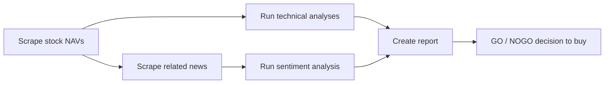

# Getting things done with <span class="dm-accent">Airflow</span>

<p class="mt-6 text-lg opacity-80"><code>github.com/datamindedacademy/workflows_with_airflow</code></p>

---
layout: default
label: Intro
---

# Who am <span class="dm-accent">I?</span>

<!--
<DmColumns class="mt-6">
<DmColumn header="Cedric Mingneau" tone="navy">

- Data Engineer, Data Minded (since 2022)
- Providing services for Luminus
- Previously: Data Engineer at Selligent Marketing Cloud (2021 – 2022)

</DmColumn>
</DmColumns>
-->

<DmColumns class="mt-6">
<DmColumn header="Jos Teunissen" tone="violet">

- Data Engineer, Data Minded (since 2023)
- Providing services for Luminus
- Before that: UGent (Centre for Molecular Modelling), Royal Belgian Institute for Space Aeronomy, VUB, Rijksuniversiteit Groningen

</DmColumn>
</DmColumns>

---
layout: agenda
label: Contents
---

# Contents

1. Workflow orchestration
2. Creating an Airflow DAG
3. Best practices
4. Cross-DAG dependencies
5. Providing clarity
6. Sharing data & configuration

---
layout: section
---

# Workflow <span class="dm-accent">orchestration</span>

---
layout: default
label: 1 · Workflow orchestration
---

# Why a scheduler? A workflow triggered at a <span class="dm-accent">definite time</span>



<p class="mt-8 text-lg">Run daily, at 08h, but not in the weekends.</p>

<!--
‹#›
-->

---
layout: default
label: 1 · Workflow orchestration
---

## What is Airflow?

- A workflow scheduler, originally built at Airbnb, now mostly maintained by Astronomer.

## Why Airflow? {.mt-8}

- Open-source workflow automation of batch jobs
- Write workflows as code in Python, leveraging its rich ecosystem
- Automate multi-step processes
- Large community, easy to find information
- Easily extend functionality with custom plugins; many operations are already supported
- Built-in operators for Hadoop, Spark, SQL, and more
- Maintained via version control
- Deployed using CI/CD pipelines

---
layout: default
label: 1 · Workflow orchestration
---

# The Airflow landscape: modern <span class="dm-accent">competitors</span>

<table class="dm-table">
<thead><tr><th>Tool</th><th>Focus</th><th>Strengths</th></tr></thead>
<tbody>
<tr><td><b>Prefect</b><br/>Developer-centric</td><td>Dynamic, modern data stacks with native Python integration and less boilerplate</td><td>"Code as workflows"; dynamic task mapping; scalable hybrid-cloud agent model</td></tr>
<tr><td><b>Dagster</b><br/>Data-asset centric</td><td>Focuses on data assets rather than just tasks; strong local dev & testing</td><td>Built-in data lineage; rich UI for asset monitoring; software-defined assets</td></tr>
<tr><td><b>Argo Workflows</b><br/>Cloud-native (K8s)</td><td>Open-source, container-native workflow engine as a Kubernetes CRD</td><td>Native Kubernetes execution; YAML configuration; great for heavy ML/container jobs</td></tr>
</tbody>
</table>

---
layout: default
label: 1 · Workflow orchestration
---

# How would you automate a sequence of <span class="dm-accent">tasks?</span>

<!--
‹#›
-->

---
layout: default
label: 1 · Workflow orchestration
---

# Directed Acyclic Graphs allow <span class="dm-accent">ordering</span>

<div class="flex justify-center mt-8">
<DmBanner tone="authentic" icon="i-mdi-close-circle-outline" title="Not acyclic? Not allowed.">
Cycles have no valid execution order.
</DmBanner>
</div>

<p class="mt-8 text-lg">Valid execution orders for a DAG with edges meaning "before":</p>

<DmColumns class="mt-4">
<DmColumn tone="plain">

**1 → 3 → 2 → 4**

</DmColumn>
<DmColumn tone="plain" divider>

**1 → 3 → 4 → 2**

</DmColumn>
</DmColumns>

---
layout: default
label: 1 · Workflow orchestration
---

# Example DAG in Airflow with 5 <span class="dm-accent">tasks</span>

<div class="flex justify-center mt-6">

</div>

---
layout: default
label: 1 · Workflow orchestration
---

# Tasks come in all shapes and <span class="dm-accent">sizes</span>

<DmColumns class="mt-6" :gap="16">
<DmColumn tone="plain">

- Train a model on a GPU
- Query an API
- Execute a Spark job
- Execute ML inference
- Load, clean and store a dataframe
- Read from an API and store in a bucket

</DmColumn>
<DmColumn tone="plain" divider>

- Read from a bucket and store in Snowflake
- Create a PDF
- Execute SQL on Snowflake
- Send an email
- Call GPT-4
- Run a Docker container
- Join 2 parquet tables and aggregate

</DmColumn>
</DmColumns>

---
layout: statement
---

# Exercise 0: hello airflow

<p class="text-lg mt-2 opacity-90">Intro to the Airflow UI and running your first DAG</p>
<p class="exercise-path"><code>0_hello_airflow</code></p>

<!--
DEBUG ISSUES: you might have to strip the `next` parameter from your forwarder URL, e.g.
https://.../api/v2/auth/login?next=https%3A%2F%2F...
-->

---
layout: section
---

# The Airflow <span class="dm-accent">architecture</span>

---
layout: default
label: 2 · Architecture
---

# Why Airflow <span class="dm-accent">3?</span>

<DmColumns class="mt-6" :gap="16">
<DmColumn tone="plain">

- **Decoupled architecture** — the Task SDK means workers no longer need full DAG file access
- **Performance boost** — removes "parsing loop" bottlenecks for near-instant task startup
- **Massive scalability** — designed for millions of daily tasks with a lighter footprint

</DmColumn>
<DmColumn tone="plain" divider>

- **Data-first design** — first-class support for Data Assets and event-driven scheduling
- **Enhanced DevEx** — a modernized UI and improved local development experience

</DmColumn>
</DmColumns>

---
layout: default
label: 2 · Architecture
---

# For daily interactions with workflows, you use Airflow's <span class="dm-accent">dashboard</span>

<DmProcess class="mt-8">
<DmPhase label="Scheduler" />
<DmPhase label="Executor" />
<DmPhase label="Workers" />
<DmPhase label="Metadata DB" />
</DmProcess>

<div class="mt-8">

- **Workers** — subprocesses running the tasks
- **Metadata database** — preserves state: task status, runtime, configuration, …
- **Scheduler** — monitors and stays in sync with the DAG folder; periodically inspects active tasks to see whether they can be triggered, and if so delegates to a worker

</div>

<DmBanner tone="authentic" icon="i-mdi-alert-outline" class="mt-6">
Do not let the scheduler do any time-consuming processing. It runs your job one <code>schedule_interval</code> <b>after</b> the <code>start_date</code>, at the end of the period.
</DmBanner>

<!--
Scheduler: process running on a server, delegates tasks to workers, shouldn't do any processing
work (though it technically can), needs to cycle through DAGs so shouldn't be "distracted".
Executor: defines the system that starts workers (celery, kubernetes, local). Local runs
sequentially, best for testing. Communication between scheduler and worker happens through a
messaging queue (e.g. Redis).
Worker: also a process, can run on different machines (like EC2 instances).
Metadata: used by the scheduler — were tasks successful, how long did they run, should other
tasks run given this info, etc.
-->

---
layout: section
---

# The web <span class="dm-accent">UI</span>

---
layout: default
label: 2 · Architecture
---

# Web UI: DAGs <span class="dm-accent">view</span>

<div class="flex justify-center mt-4">

</div>

<!--
Important columns:
Owner — assigns owners to DAGs so only they can see and control them; "airflow" as owner
preserves a "see-all" view.
Runs (in order) — how many successful DAG runs, how many running right now, how many failures?
Recent Tasks — specific to task runs, also shows different states (skipped, retries, queued,
failed, etc.).
-->

---
layout: default
label: 2 · Architecture
---

# Web UI: grid view <span class="dm-accent">(replaces the tree view)</span>

<div class="flex justify-center mt-4">

</div>

---
layout: default
label: 2 · Architecture
---

# Web UI: graph <span class="dm-accent">view</span>

<div class="flex justify-center mt-4">

</div>

<p class="mt-4 text-center text-lg">Great in development, because a picture says more than a thousand words (of Python 🐍).</p>

---
layout: default
label: 2 · Architecture
---

# Web UI: Gantt <span class="dm-accent">chart</span>

<div class="flex justify-center mt-4">

</div>

<div class="mt-4">

Good for observing the duration of a specific task run, and parallelism within a DAG (⚠️ parallelism is configurable). Less ideal for task dependencies — use the Graph tab for that.

</div>

---
layout: default
label: 2 · Architecture
---

# Web UI: calendar <span class="dm-accent">view</span>

<div class="flex justify-center mt-4">

</div>

<!--
‹#›
-->

---
layout: default
label: 2 · Architecture
---

# Web UI: code <span class="dm-accent">view</span>

<div class="mt-4">

A read-only view on the code behind the workflow. Good for checking what is actually deployed right now.

</div>

<div class="flex justify-center mt-4">

</div>

<!--
Read-only view. "Has Airflow picked up my new changes?" It can take up to 30s before the
scheduler has updated the DAG code. Alternatively, you can also rename your DAG.
-->

---
layout: section
---

# Creating an Airflow <span class="dm-accent">DAG</span>

---
layout: default
label: 3 · Creating a DAG
---

# Airflow <span class="dm-accent">scheduling</span>

<div class="mt-4">

- Each DAG has a schedule and a unique `dag_id`
- Each DAG has at least one task
- Each task belongs to a DAG and has a unique `task_id`
- Each task is an instance of an operator
- Tasks run only when all upstream tasks succeeded by default, but this is configurable via `trigger_rule` (e.g. `trigger_rule="one_failed"`)
- Many operator types exist: `BashOperator`, `PythonOperator`, `KubernetesPodOperator`, `SSHOperator`, … and you can make your own

</div>

---
layout: default
label: 3 · Creating a DAG
---

# Airflow scheduling: how to <span class="dm-accent">schedule</span>

<div class="mt-4">

Scheduled DAG runs are triggered after a data interval is completed. Ways to schedule a DAG:

</div>

<table class="dm-table mt-4">
<thead><tr><th>Method</th><th>Example</th></tr></thead>
<tbody>
<tr><td>Presets</td><td><code>None</code>, <code>@once</code>, <code>@daily</code>, <code>@weekly</code></td></tr>
<tr><td>Cron syntax</td><td><code>*/5 1,2 * * *</code></td></tr>
<tr><td><code>datetime.timedelta</code></td><td><code>datetime.timedelta(days=4)</code></td></tr>
<tr><td>Timetable</td><td>an explicit list of dates</td></tr>
<tr><td>Asset</td><td>each time another process updates an Asset</td></tr>
</tbody>
</table>

<p class="mt-4">Trigger rules: default is <code>all_success</code>, but other possibilities exist.</p>

---
layout: default
label: 3 · Creating a DAG
---

# Scheduled DAG runs happen after the date interval <span class="dm-accent">ends</span>

<div class="mt-4">

- Each DAG run has a date interval that represents the time range it operates in
- A DAG run is scheduled after its date interval has ended, to ensure it can collect all the data within that period
- The execution date of a DAG run mostly denotes the **start** of the date interval, not when the DAG is actually executed

</div>

<!--
‹#›
-->

---
layout: default
label: 3 · Creating a DAG
---

# Airflow scheduling: <span class="dm-accent">cron</span> syntax

<div class="cron-box mt-4">
┌───────────── minute (0 - 59)
│ ┌───────────── hour (0 - 23)
│ │ ┌───────────── day of the month (1 - 31)
│ │ │ ┌───────────── month (1 - 12)
│ │ │ │ ┌───────────── day of the week (0 - 6) (0: Su, 6: Sa)
│ │ │ │ │
* * * * *  &lt;command to execute&gt;
</div>

<p class="mt-4">Mnemonic: <b>Mi Ho Da Mo We</b>.</p>

<DmColumns class="mt-4" :gap="16">
<DmColumn tone="plain">

- `*/5 1,2,3 * * *` — every 5th minute of the 1st, 2nd and 3rd hour
- `*/5 1-3 * * *` — same as above

</DmColumn>
<DmColumn tone="plain" divider>

- `*/30 * * * 0` — every half hour on Sunday

</DmColumn>
</DmColumns>

<p class="mt-4 text-lg">Use tools like <a href="https://crontab.guru">crontab.guru</a> to verify the expression matches your intent.</p>

<!--
The 6th field (if present) refers to seconds. If you need second-level triggers you probably want
a different tool/framework — that's near-real-time event processing (Kafka/Flink/Spark Streaming).
A cron job can't run "every 5 days" → use datetime.timedelta. Time has to be divisible by 5.
Timetables: complex, usually not needed — used when you can't regularly run your DAG (e.g. at
sunrise, which changes every day); refer to docs, defined in Python code.
Datasets: whenever a dataset changes.
-->

---
layout: default
label: 3 · Creating a DAG
---

# The Python Operator executes a Python callable on a <span class="dm-accent">worker</span>

```python {all|1-2|4-6|8-13|9-10}
from airflow import DAG
from airflow.providers.standard.operators.python import PythonOperator

def say_hello():
    print("Hello Airflow")
    return "this goes to xcom"

with DAG(
    dag_id='hello_airflow',
    schedule="@daily",  # Adjust as needed
    start_date='2026-01-01'
) as dag:
    task = PythonOperator(
        task_id="hello_world",
        python_callable=say_hello
    )
```

<!--
‹#›
-->

---
layout: default
label: 3 · Creating a DAG
---

# We recommend the PythonOperator over the <span class="dm-accent">TaskFlow API</span>

<DmBanner tone="authentic" icon="i-mdi-thought-bubble-outline" title="🤔 Counterarguments (from the Airflow docs)">
Proceed with the TaskFlow API when you're aware of the consequences — and your teammates' abilities.
</DmBanner>

<div class="mt-6">

- Decorators (the `@some_func`) are not beginner friendly
- Style break: mixing a `PythonOperator` created via decorator with other operators means they don't look the same
- Confusing: the function call on the last line makes it look like a function will be executed by the scheduler, which is not quite the case
- Non-trivial Python code should be packaged and deployed outside of Airflow DAG files

</div>

<!--
‹#›
-->

---
layout: statement
---

# Exercise 1: investing

<p class="text-lg mt-2 opacity-90">Top-level code cost — why heavy work at import time slows the scheduler</p>
<p class="exercise-path"><code>1_investing</code></p>

---
layout: statement
---

# Exercise 2: birthday

<p class="text-lg mt-2 opacity-90">Scheduling basics: presets vs. cron, aligning <code>start_date</code>, <code>catchup=False</code></p>
<p class="exercise-path"><code>2_birthday</code></p>

<!--
Check: https://airflow.apache.org/docs/apache-airflow/stable/templates-ref.html
-->

---
layout: default
label: 3 · Creating a DAG
---

# `@yearly` scheduling does not work as you might <span class="dm-accent">expect</span>

<div class="mt-4">

It aligns execution to the start of the year (at 00:00) — not to the date you had in mind.

</div>

<!--
‹#›
-->

---
layout: default
label: 3 · Creating a DAG
---

# Cron syntax does work! Keep in mind: execution happens at the <span class="dm-accent">end</span> of the interval

<!--
‹#›
-->

---
layout: statement
---

# Exercise 3: birthday_full

<p class="text-lg mt-2 opacity-90">Templating with Jinja: <code>data_interval_end</code> (logical date) vs. wall-clock time</p>
<p class="exercise-path"><code>3_birthday_full</code></p>

---
layout: default
label: 3 · Creating a DAG
---

# Variables, macros & filters add context dynamically at <span class="dm-accent">run-time</span>

<div class="mt-4">

Templates and macros in Apache Airflow are powerful for making tasks dynamic and idempotent when you need time as input.

</div>

<DmBanner tone="authentic" icon="i-mdi-alert-outline" class="mt-6">
<code>{{ ds }}</code> is the DAG run's logical date, as a <code>YYYY-MM-DD</code> string.
</DmBanner>

<p class="mt-4">Without templating, mixing languages in one file causes: incorrect syntax highlighting, poor autocompletion, and meaningless scheduler compute. What happens if the DAG run failed on Saturday and you could only rerun it the Monday after?</p>

<!--
Jinja templates delay reading a value until task execution: {{ var.value.<variable_name> }}.
Some templates return Pendulum.datetime objects — convert to strings with filters, e.g.
{{ data_interval_start | ds }}. Note: {{ params.table }} is not an Airflow template, it's specific
to the PostgresOperator.
-->

---
layout: default
label: 3 · Creating a DAG
---

# Macros let you use Python functions inside Jinja <span class="dm-accent">templates</span>

<!--
Whenever you want pure-Python functionality inside a template, access it via a macro. It's
possible to define your own. var.value → variables you define in the Airflow interface.
‹#›
-->

---
layout: default
label: 3 · Creating a DAG
---

# Some operators come with Airflow. Others are optional — or <span class="dm-accent">custom</span>

<DmColumns class="mt-4" :gap="16">
<DmColumn header="Popular core operators" tone="navy">

- `BashOperator` — executes a bash command
- `PythonOperator` — calls a Python function
- `EmailOperator` — sends an email
- `BranchPythonOperator` — decides the next `task_id`
- `ShortCircuitOperator` — stops execution based on a condition

</DmColumn>
<DmColumn header="Popular provider-package operators" tone="violet" divider>

- `SimpleHttpOperator`
- `SSHOperator` — execute commands on another server
- `PostgresOperator`
- `DockerOperator`
- `LivyOperator`
- `S3FileTransformOperator`
- Many more in the [providers packages listing](https://airflow.apache.org/docs/apache-airflow-providers/)

</DmColumn>
</DmColumns>

<!--
BranchOperator: possible to run a task in a DAG once every x runs. PythonBranchOperator: the
python function returns the task_id of the downstream task.
Provider packages: Airflow operators, managed by external parties, to communicate with external
services (like cloud services e.g. BigQuery).
-->

---
layout: default
label: 3 · Creating a DAG
---

# Should you use the most specific operator? Provider <span class="dm-accent">packages?</span>

<div class="mt-4">

Depending on externally defined operators to execute logic creates tight coupling between your orchestration tool and the tasks you want to run: an operator inherently combines orchestration bugs with execution bugs, requires all used components to be compatible, and promotes system lock-in.

</div>

<DmBanner tone="authentic" icon="i-mdi-lightbulb-outline" class="mt-6">
Airflow environments should be lean. Standardize on a limited set of operators suited to generic tasks — containers are a good fit. A task created with <code>SimpleHttpOperator</code> could equally run via <code>BashOperator</code> or <code>PythonOperator</code>. Trade-off: atomicity vs. level of abstraction.
</DmBanner>

<!--
E.g. what if curl isn't on the worker? What if the requests lib isn't installed, or the wrong
version? Task-specific operators come "with the batteries included". Remark on PythonOperator:
packages need to be installed on the workers! Why not plain http? How do you store the result?
-->

---
layout: default
label: 3 · Creating a DAG
---

# Trigger rules: customize when to trigger a <span class="dm-accent">task</span>

<div class="mt-4">

Default (and optional) argument for all operators. A task starts once all of its upstream tasks have completed successfully — but some scenarios need different rules.

</div>

<p class="mt-4 text-lg">❤️ Type safety? → <code>airflow.utils.trigger_rule.TriggerRule</code></p>

<!--
If you like type safety, replace the strings with class attributes from
airflow.utils.trigger_rule.TriggerRule. Remark on one_failed/all_failed: you can also add a
callback via on_failure_callback, triggered when a task in the DAG fails. all_done means all
parent tasks are SUCCESS, FAILED, UPSTREAM_FAILED or SKIPPED.
-->

---
layout: section
---

# DAG-authoring <span class="dm-accent">patterns</span>

---
layout: statement
---

# Exercise 4: saturday

<p class="text-lg mt-2 opacity-90">Catchup & backfills: <code>catchup=True</code>, logical/execution date vs. <code>datetime.now()</code>, skipped vs. failed states</p>
<p class="exercise-path"><code>4_saturday</code></p>

---
layout: statement
---

# Exercise 5: repetition

<p class="text-lg mt-2 opacity-90">DRY DAGs — generating tasks and dependencies programmatically instead of copy-pasting</p>
<p class="exercise-path"><code>5_repetition</code></p>

<!--
Why do we use a programming language to define what is essentially config?
See: https://www.astronomer.io/docs/learn/managing-dependencies
Options for "years since": (data_interval_end - dag.start_date).in_years(),
data_interval_end.diff(dag.start_date).in_years(), airflow.macros.datetime_diff_for_humans (ugly
strings), or a Python callable: def years_today(name, dag, data_interval_end) — see PythonOperator
docs.
-->

---
layout: section
---

# Best <span class="dm-accent">practices</span>

---
layout: default
label: 4 · Best practices
---

# Airflow best <span class="dm-accent">practices</span>

<div class="mt-4">

- Don't perform time-consuming operations at the top level. The scheduler shouldn't make database connections, run simulations, or transform tables — put that work in operators
- **Create idempotent workflows.** You should be able to "time travel" and rerun jobs weeks after their intended trigger moment, as if they ran on the day they had to. Use upserts instead of inserts, or set retries to 0
- Each DAG has an owner / responsible
- Specify timezone to prevent time-zone issues: `pendulum.datetime(2024, 7, 1).in_tz("Europe/Paris")`
- Only a very limited amount of data can be shared between operators via XComs — if two operators need to share information, consider combining them into one operator, or communicating via shared files

</div>

---
layout: default
label: 4 · Best practices
---

# Documentation: add <span class="dm-accent">tags</span>

```python
dag = DAG(
    dag_id="example_bash_operator",
    schedule_interval="0 0 * * *",
    tags=["example", "example2"],
)
```

<DmBanner tone="authentic" icon="i-mdi-alert-outline" class="mt-6">
Tag filters work via browser cookies.
</DmBanner>

<p class="mt-4">💡 Use department, team name, distribution group, or project/product name as tags.</p>

<!--
Possible to filter on tags. Attach department name, team name. Can also be used to assign owners
(when the owner column isn't used). Good for notifying teams of failing DAGs. Good for deprecating
potentially unused DAGs.
-->

---
layout: default
label: 4 · Best practices
---

# Documentation: simply add <span class="dm-accent">documentation</span>

<div class="mt-4">

- DAG description
- DAG doc (`__doc__` can be assigned directly from the file's top-of-file docstring)
- Task doc — for longer explanations, prefer linking out to a wiki page

</div>

<!--
__doc__ can immediately be assigned if the docstring is defined at the top of the file. Makes a
DAG's purpose clear without reading the code. Also useful for managers to see a description in the
Airflow dashboard.
-->

---
layout: default
label: 4 · Best practices
---

# Task chaining <span class="dm-accent">shorthands</span>

```python {all|1-3|5-7|9-11}
# Simple chain
a >> b >> c

# Fan-out / fan-in
a >> [b, c] >> d

# Cross-downstream: use chain()
from airflow.models.baseoperator import chain
chain(a, [b, c], [d, e])
```

<!--
Note: it's not possible to chain two or more lists of tasks directly — use the chain() function.
Cross-downstream is useful when ingesting tables and waiting for them to be available before
processing further; also possible to replicate using an EmptyOperator in the middle.
-->

---
layout: default
label: 4 · Best practices
---

# Task groups hide <span class="dm-accent">complexity</span>

```python
from airflow.utils.task_group import TaskGroup

with TaskGroup("ingest_tables") as ingest:
    for table in tables:
        PythonOperator(task_id=f"ingest_{table}", python_callable=ingest_table)
```

<!--
Many similar tasks happening in parallel (e.g. scraping several websites) creates a lot of
repetition — abstract into TaskGroups. Appears as a single task in Graph View, expandable by
clicking. Doesn't change functionality. E.g. first group is "ingress tables", second could be
"egress tables".
-->

---
layout: default
label: 4 · Best practices
---

# Always specify your DAG's timezone for peace of mind around <span class="dm-accent">DST</span>

<DmBanner tone="authentic" icon="i-mdi-alert-outline" class="mt-4">
Use a <code>pendulum</code> datetime instance, not one from the builtin <code>datetime</code> module.
</DmBanner>

<!--
Specify timezones when setting datetimes, using the pendulum library. Scheduled dates will be
relative to the timezone you specify in the web UI.
-->

---
layout: default
label: 4 · Best practices
---

# Managed <span class="dm-accent">Airflow</span>

<DmColumns class="mt-6">
<DmColumn header="AWS" tone="navy">

- MWAA
- Astronomer

</DmColumn>
<DmColumn header="Google Cloud" tone="violet" divider>

- Composer
- Conveyor

</DmColumn>
</DmColumns>

---
layout: statement
---

# Exercise 6: failing_tasks

<p class="text-lg mt-2 opacity-90">Trigger rules — default <code>ALL_SUCCESS</code>, <code>ALL_DONE</code> / <code>ONE_SUCCESS</code>, letting downstream work survive an upstream failure</p>
<p class="exercise-path"><code>6_failing_tasks</code></p>

---
layout: statement
---

# Exercise 7: ignoring_failure

<p class="text-lg mt-2 opacity-90">Trigger rules with retries & branching</p>
<p class="exercise-path"><code>7_ignoring_failure</code></p>

---
layout: section
---

# Cross-DAG <span class="dm-accent">dependencies</span>

---
layout: default
label: 5 · Cross-DAG dependencies
---

# Sharing <span class="dm-accent">data</span>

<div class="mt-4">

From the Airflow docs on operators: "in general, if two operators need to share information, like a filename or small amount of data, you should consider combining them into a single operator."

</div>

<DmBanner tone="authentic" icon="i-mdi-thought-bubble-outline" class="mt-6">
🤔 If there's no other way, use the XCom mechanism. Note it's stored in the metadata database — consider size and serializability ("picklability") before using it.
</DmBanner>

<p class="mt-4">💡 Most of the time, pass data between tasks via an external storage mechanism, like cloud blob storage.</p>

<!--
Lots of examples: https://big-data-demystified.ninja/2020/04/15/airflow-xcoms-example-airflow-demystified/
Don't abuse XCom — only send small data (strings, a datetime). It needs to be serialized, sent
over the wire, and stored in the metadatabase. Better to combine the work into a single operator,
or store on an external service (like S3).
-->

---
layout: default
label: 5 · Cross-DAG dependencies
---

# SubDAGs are deprecated: use TaskGroups or <span class="dm-accent">Trigger/Sensor</span> combos

<div class="mt-4">

- Sensors are specialized operators with a "poke" method
- It's not possible to create direct dependencies between tasks belonging to different DAGs
- Mimic these dependencies using an `ExternalTaskSensor` (comes with a builtin sensor!)
- A DAG run can be triggered with `TriggerDagRunOperator` (comes with a sensor too!)

</div>

<!--
TaskSensor is a pull system (you're waiting for something to finish) — needs the external dag_id
and task_id. TriggerDagRunOperator is a push system, and has a sensor so the task itself finishes
when the external DAG is finished (wait_for_completion) — needs the name of the external task.
Possible to pass the execution_date (logical_date) used for the triggered DAG.
-->

---
layout: statement
---

# Exercise 8: reporting_sensor

<p class="text-lg mt-2 opacity-90">Cross-DAG dependencies with <code>ExternalTaskSensor</code> — why schedules and start dates must line up across DAGs</p>
<p class="exercise-path"><code>8_reporting_sensor</code></p>

---
layout: statement
---

# Exercise 9: reporting_dataset_dependence

<p class="text-lg mt-2 opacity-90">Event-driven / data-aware scheduling with Datasets and outlets, contrasted with interval-based scheduling</p>
<p class="exercise-path"><code>9_reporting_dataset_dependence</code></p>

---
layout: section
---

# Providing <span class="dm-accent">clarity</span>

---
layout: default
label: 6 · Providing clarity
---

# Unequally sized data intervals can produce surprising <span class="dm-accent">summaries</span>

<div class="mt-4">

Using Airflow variables like <code>ds</code>, <code>{{ ds }}</code> and <code>{{ next_ds }}</code> for the 5th data interval can end up further apart than intended.

</div>

<p class="mt-4">If you want to report on just the business days, replace <code>{{ next_ds }}</code> with a macro.</p>

<!--
Want to skip Saturday and Sunday? Use BranchDayOfWeekOperator and check if the day of week is
Saturday or Sunday.
-->

---
layout: default
label: 6 · Providing clarity
---

# An event-triggered <span class="dm-accent">workflow</span>

<DmProcess class="mt-8">
<DmPhase label="Uploaded file to FTP" />
<DmPhase label="Retrieve file from server" />
<DmPhase label="Process the data" />
<DmPhase label="Store in internal storage" />
<DmPhase label="Send report" />
</DmProcess>

<div class="mt-8">

A workflow: steps, order, a graph of entities with relationships (nodes & edges), direction between nodes, acyclic (no revisiting nodes), and staying high-level — it describes the **what**, not the **how**.

</div>

---
layout: default
label: 6 · Providing clarity
---

# A workflow is defined by the DAG class and its <span class="dm-accent">operators</span>

```python {all|1-6|8-12}
with DAG(
    dag_id="reporting",
    schedule="@daily",
    start_date=pendulum.datetime(2024, 1, 1, tz="Europe/Brussels"),
    default_args={"retries": 1},  # passed to every operator, overridable per task
) as dag:
    retrieve = PythonOperator(task_id="retrieve", python_callable=retrieve_file)
    process = PythonOperator(task_id="process", python_callable=process_data)
    store = PythonOperator(task_id="store", python_callable=store_data)

    retrieve >> process >> store
```

<div class="mt-4">

`dag_id`s and `task_id`s must be unique so you can reference them (e.g. from an `ExternalTaskSensor`). 💡 Don't repeat strings all over the place — imagine fixing a typo. IDEs can autorename objects, but not standalone strings.

</div>

---
layout: default
label: 6 · Providing clarity
---

# To modify workflows, you interact with the files in the DAGs <span class="dm-accent">folder</span>

<DmProcess class="mt-8">
<DmPhase label="DAGs folder" />
<DmPhase label="Scheduler parses" />
<DmPhase label="Web UI shows state" />
<DmPhase label="Monitoring / ops" />
</DmProcess>

<p class="mt-8 text-lg">On rare occasions you'd use the Airflow CLI, or inspect the scheduler logs directly.</p>

---
layout: section
---

# Sharing data & <span class="dm-accent">configuration</span>

---
layout: default
label: 7 · Sharing data & configuration
---

# Global variables and connections: runtime-dependent, <span class="dm-accent">global</span> configuration

<DmBanner tone="authentic" icon="i-mdi-alert-outline">
Do not use them to pass data from one task to another — use XComs instead, or better, store data externally.
</DmBanner>

<table class="dm-table mt-4">
<thead><tr><th></th><th>Metastore DB</th><th>Environment variables</th><th>Secrets backend</th></tr></thead>
<tbody>
<tr><td><b>Create / read / update / delete</b></td><td>Web UI, CLI, programmatically</td><td><code>export AIRFLOW_VAR_FOO=BAR</code></td><td>Depends on backend</td></tr>
<tr><td><b>Priority</b></td><td>3</td><td>2</td><td>1</td></tr>
<tr><td><b>Notes</b></td><td>&nbsp;</td><td>Won't show in the UI</td><td>Won't show in the UI; also works for config settings via the <code>_secret</code> suffix</td></tr>
</tbody>
</table>

<!--
Web UI: Admin -> Variables (user-defined, e.g. {env: pro}, available to all DAG files; keywords
like "secret"/"password" get obfuscated). Admin -> Connections (host, login, pwd, etc.; the
Connection Id is used in operators to refer to the settings). Everything configured in the web UI
is stored in the metastore DB.
CLI: airflow variables set <key> <value>, airflow variables import <file> (also stored in the
metastore DB).
Programmatically: from airflow.models.variable import Variable; Variable.set() / Variable.get().
Environment variables: prefix with AIRFLOW_VAR_, accessible via Variable.get() or
os.environ['<name>'].
Secrets backend: previous approaches don't scale to reuse across systems — a password change means
updating Airflow AND every other script. AWS Secrets Manager, GCP Secret Manager, Azure Key Vault;
Airflow admins configure access to these backends.
-->

---
layout: statement
---

# Exercise 10: xcoms

<p class="text-lg mt-2 opacity-90">Passing data via XCom and dynamic task mapping (<code>.expand()</code>) — classic API vs. TaskFlow API</p>
<p class="exercise-path"><code>10_xcoms_classicapi</code> / <code>10_xcoms_taskflowapi</code></p>

---
layout: statement
---

# Exercise 11: connections_and_hooks

<p class="text-lg mt-2 opacity-90">Airflow Connections & <code>PostgresHook</code> — why hardcoded credentials in a DAG file are a security review finding</p>
<p class="exercise-path"><code>11_connections_and_hooks</code></p>

---
layout: section
---

# Capstone <span class="dm-accent">exercise</span>

---
layout: default
label: 8 · Capstone
---

# Capstone exercise: something more <span class="dm-accent">realistic</span>

<DmProcess class="mt-8">
<DmPhase label="File uploaded to S3" />
<DmPhase label="Retrieve API key via SSM secrets backend" />
<DmPhase label="Call the API with that key" />
</DmProcess>

<p class="mt-8 text-lg">Combines Connections, secrets backends, and everything else covered so far into one realistic pipeline.</p>

---
layout: default
label: 8 · Capstone
---

# Resources

<p class="mt-4"><a href="https://medium.com/datamindedbe/cross-dag-dependencies-in-apache-airflow-a-comprehensive-guide-88cbc0bc68d0">Cross-DAG dependencies in Apache Airflow: a comprehensive guide</a></p>

---
layout: default
label: 8 · Capstone
---

# Airflow: what's <span class="dm-accent">next?</span>

<div class="mt-4 dm-recap">

- Custom operators and hooks: write your own, or run hooks on retry/exit
- Hosting Airflow: cloud vs. self-hosted; LocalExecutor vs. CeleryExecutor vs. KubernetesExecutor
- CI/CD deployment
- Airflow testing and DAG validation
- Managing secrets
- Monitoring
- Data governance / publishing lineage
- Dynamic DAG creation, e.g. from YAML files

</div>

---
layout: default
label: 8 · Capstone
---

# Best practices, once more

<div class="mt-4">

- Don't perform time-consuming operations at the top level — the scheduler shouldn't make database connections, run simulations, or transform tables; put that work in operators
- Simplify the config (Airflow is config-as-code): use Python and Airflow constructs (for-loops, imports, `BranchOperator`) for modular, DRY workflows-as-code
- Create idempotent workflows: you should be able to "time travel" and rerun jobs weeks after their intended trigger moment

</div>

---
layout: thanks
---

# Thank you!

<p class="mt-4 text-xl">Questions?</p>

<!--
‹#›
-->
