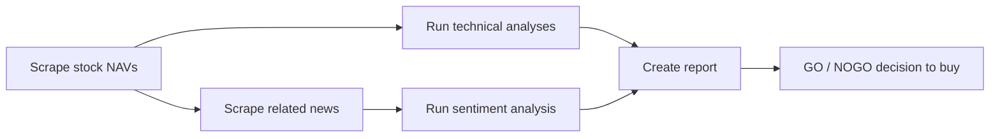
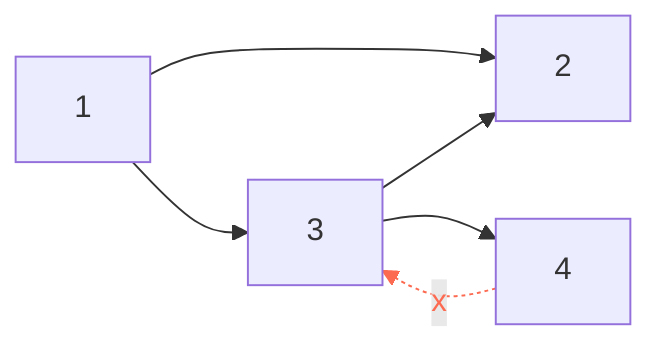

# Getting things done with <span class="dm-accent">Airflow</span>

<p class="mt-6 text-lg opacity-80"><code>github.com/datamindedacademy/workflows_with_airflow</code></p>

---
layout: default
label: Intro
---

# Who am <span class="dm-accent">I?</span>

<!--
<DmColumns class="mt-6">
<DmColumn header="Cedric Mingneau" tone="navy">

- Data Engineer, Data Minded (since 2022)
- Providing services for Luminus
- Previously: Data Engineer at Selligent Marketing Cloud (2021 – 2022)

</DmColumn>
</DmColumns>
-->

<DmColumns class="mt-6">
<DmColumn header="Jos Teunissen" tone="violet">

- Data Engineer, Data Minded (since 2023)
- Providing services for Luminus
- Before that: UGent (Centre for Molecular Modelling), Royal Belgian Institute for Space Aeronomy, VUB, Rijksuniversiteit Groningen

</DmColumn>
</DmColumns>

---
layout: agenda
label: Contents
---

# Contents

1. Orchestration
2. Architecture
3. The web UI
4. Building a DAG
5. Scheduling
6. Templating
7. DAG design patterns
8. Operators & trigger rules
9. Cross-DAG dependencies
10. Sharing data & configuration
11. Best practices
12. Wrap-up

---
layout: section
---

# <span class="dm-accent">Orchestration</span>

---
layout: default
label: 1 · Orchestration
---

# Why a scheduler? A workflow triggered at a <span class="dm-accent">definite time</span>



<p class="mt-8 text-lg">Run daily, at 08h, but not in the weekends.</p>

---
layout: default
label: 1 · Orchestration
---

## What is Airflow?

- A workflow scheduler, originally built at Airbnb, now mostly maintained by Astronomer.

## Why Airflow?

- Open-source workflow automation of batch jobs
- Write workflows as code in Python, leveraging its rich ecosystem
- Automate multi-step processes
- Large community, easy to find information
- Easily extend functionality with custom plugins; many operations are already supported
- Built-in operators for Hadoop, Spark, SQL, and more
- Maintained via version control
- Deployed using CI/CD pipelines

---
layout: cards
---

# The Airflow landscape: modern <span class="dm-accent">competitors</span>

<template #cards>
<DmCard header="Prefect" tone="violet">

**Developer-centric**

Dynamic, modern data stacks with native Python integration and less boilerplate.

- "Code as workflows"
- Dynamic task mapping
- Scalable hybrid-cloud agent model

</DmCard>
<DmCard header="Dagster" tone="navy">

**Data-asset centric**

Focuses on data assets rather than just tasks; strong local dev & testing.

- Built-in data lineage
- Rich UI for asset monitoring
- Software-defined assets

</DmCard>
<DmCard header="Argo Workflows" tone="violet" class="card-argo">

**Cloud-native (K8s)**

Open-source, container-native workflow engine as a Kubernetes CRD.

- Native Kubernetes execution
- YAML configuration
- Great for heavy ML/container jobs

</DmCard>
</template>

---
layout: statement
---

# How would you automate a sequence of <span class="dm-accent">tasks?</span>

<p class="mt-6 text-lg opacity-90">Take a minute. What has to be true before a step may start?</p>

---
layout: default
label: 1 · Orchestration
---

# Directed Acyclic Graphs allow <span class="dm-accent">ordering</span>

<div class="flex justify-center mt-2">



</div>

<p class="mt-4 text-lg">Valid execution orders for this DAG, with edges meaning "before":</p>

<DmColumns class="mt-4">
<DmColumn tone="plain">

**1 → 3 → 2 → 4**

</DmColumn>
<DmColumn tone="plain" divider>

**1 → 3 → 4 → 2**

</DmColumn>
</DmColumns>

<div class="flex justify-center mt-6">
<DmBanner tone="authentic" icon="i-mdi-close-circle-outline" title="Not acyclic? Not allowed.">
Cycles have no valid execution order.
</DmBanner>
</div>

---
layout: default
label: 1 · Orchestration
---

# A workflow describes the <span class="dm-accent">what</span>, not the how

<DmProcess class="mt-6">
<DmPhase label="Uploaded file to FTP" />
<DmPhase label="Retrieve file from server" />
<DmPhase label="Process the data" />
<DmPhase label="Store in internal storage" />
<DmPhase label="Send report" />
</DmProcess>

<DmColumns class="mt-8" :gap="16">
<DmColumn tone="plain">

- **Steps**, in a defined **order**
- A **graph**: entities with relationships — nodes & edges
- **Direction** between the nodes

</DmColumn>
<DmColumn tone="plain" divider>

- **Acyclic**: no revisiting nodes
- Stays **high-level**: it describes the *what*, not the *how*

</DmColumn>
</DmColumns>

---
layout: default
label: 1 · Orchestration
---

# Example DAG in Airflow with 5 <span class="dm-accent">tasks</span>

<div class="flex justify-center mt-6">

</div>

---
layout: default
label: 1 · Orchestration
---

# Tasks come in all shapes and <span class="dm-accent">sizes</span>

<DmColumns class="mt-6" :gap="16">
<DmColumn tone="plain">

- Train a model on a GPU
- Query an API
- Execute a Spark job
- Execute ML inference
- Load, clean and store a dataframe
- Read from an API and store in a bucket

</DmColumn>
<DmColumn tone="plain" divider>

- Read from a bucket and store in Snowflake
- Create a PDF
- Execute SQL on Snowflake
- Send an email
- Call GPT-4
- Run a Docker container
- Join 2 parquet tables and aggregate

</DmColumn>
</DmColumns>

---
layout: statement
---

# Exercise 0

<div class="ex-grid ex-grid--single">
<div class="ex-item">
<p class="ex-name">0 · hello airflow</p>
<p class="ex-desc">Intro to the Airflow UI and running your first DAG</p>
<p class="exercise-path"><code>0_hello_airflow</code></p>
</div>
</div>

<!--
DEBUG ISSUES: you might have to strip the `next` parameter from your forwarder URL, e.g.
https://.../api/v2/auth/login?next=https%3A%2F%2F...
-->

---
layout: section
---

# <span class="dm-accent">Architecture</span>

---
layout: default
label: 2 · Architecture
---

# Why Airflow <span class="dm-accent">3?</span>

<DmColumns class="mt-6" :gap="16">
<DmColumn tone="plain">

- **Decoupled architecture** — the Task SDK means workers no longer need full DAG file access
- **Performance boost** — removes "parsing loop" bottlenecks for near-instant task startup
- **Massive scalability** — designed for millions of daily tasks with a lighter footprint

</DmColumn>
<DmColumn tone="plain" divider>

- **Data-first design** — first-class support for Data Assets and event-driven scheduling
- **Enhanced DevEx** — a modernized UI and improved local development experience

</DmColumn>
</DmColumns>

---
layout: default
label: 2 · Architecture
---

# Airflow 2 vs. Airflow <span class="dm-accent">3</span>

<DmColumns class="mt-4" :gap="16">
<DmColumn header="Airflow 2" tone="navy">


</DmColumn>
<DmColumn header="Airflow 3" tone="violet" divider>


</DmColumn>
</DmColumns>

<DmBanner tone="violet" icon="i-mdi-shield-lock-outline" class="mt-6">
In Airflow 3, user-defined code no longer has direct access to the metadata database — everything goes through the API server / Task SDK.
</DmBanner>

---
layout: default
label: 2 · Architecture
---

# Scheduler, executor, workers, <span class="dm-accent">metadata DB</span>

<DmColumns class="mt-4" :gap="20">
<DmColumn tone="plain" class="col-w1">


</DmColumn>
<DmColumn tone="plain" divider class="col-w1">

- **Scheduler** — stays in sync with the DAG folder, inspects active tasks and decides what may run
- **Executor** — the system that starts workers: Local, Celery, Kubernetes
- **Workers** — subprocesses that actually run the tasks, possibly on other machines
- **Metadata database** — preserves state: task status, runtime, configuration, …

</DmColumn>
</DmColumns>

<DmBanner tone="authentic" icon="i-mdi-alert-outline" class="mt-4">
Do not let the scheduler do any time-consuming processing. It runs your job one <code>schedule_interval</code> <b>after</b> the <code>start_date</code>, at the end of the period.
</DmBanner>

<!--
Scheduler: process running on a server, delegates tasks to workers, shouldn't do any processing
work (though it technically can), needs to cycle through DAGs so shouldn't be "distracted".
Executor: defines the system that starts workers (celery, kubernetes, local). Local runs
sequentially, best for testing. Communication between scheduler and worker happens through a
messaging queue (e.g. Redis).
Worker: also a process, can run on different machines (like EC2 instances).
Metadata: used by the scheduler — were tasks successful, how long did they run, should other
tasks run given this info, etc.
-->

---
layout: default
label: 2 · Architecture
---

# You author workflows in the DAGs <span class="dm-accent">folder</span>

<DmColumns class="mt-4" :gap="20">
<DmColumn tone="plain" class="col-w1">


</DmColumn>
<DmColumn tone="plain" divider class="col-w1">

- **Create / modify workflows** → write Python files into the DAG directory
- **Monitoring / operations** → the web UI, driven by the metadata database
- **Internals** — scheduler, executor, workers — you rarely touch these directly

</DmColumn>
</DmColumns>

<p class="mt-6 text-lg">On rare occasions you'd use the Airflow CLI, or inspect the scheduler logs directly.</p>

---
layout: section
---

# The web <span class="dm-accent">UI</span>

---
layout: default
label: 3 · The web UI
---

# Web UI: DAGs <span class="dm-accent">view</span>

<div class="flex justify-center mt-4">

</div>

<!--
Important columns:
Owner — assigns owners to DAGs so only they can see and control them; "airflow" as owner
preserves a "see-all" view.
Runs (in order) — how many successful DAG runs, how many running right now, how many failures?
Recent Tasks — specific to task runs, also shows different states (skipped, retries, queued,
failed, etc.).
-->

---
layout: default
label: 3 · The web UI
---

# Web UI: grid view <span class="dm-accent">(replaces the tree view)</span>

<div class="flex justify-center mt-4">

</div>

---
layout: default
label: 3 · The web UI
---

# Web UI: graph <span class="dm-accent">view</span>

<div class="flex justify-center mt-4">

</div>

<p class="mt-4 text-center text-lg">Great in development, because a picture says more than a thousand words (of Python 🐍).</p>

---
layout: default
label: 3 · The web UI
---

# Web UI: Gantt <span class="dm-accent">chart</span>

<div class="flex justify-center mt-4">

</div>

<div class="mt-4">

Good for observing the duration of a specific task run, and parallelism within a DAG (⚠️ parallelism is configurable). Less ideal for task dependencies — use the Graph tab for that.

</div>

---
layout: default
label: 3 · The web UI
---

# Web UI: calendar <span class="dm-accent">view</span>

<div class="flex justify-center mt-4">

</div>

---
layout: default
label: 3 · The web UI
---

# Web UI: code <span class="dm-accent">view</span>

<div class="mt-4">

A read-only view on the code behind the workflow. Good for checking what is actually deployed right now.

</div>

<div class="flex justify-center mt-4">

</div>

<!--
Read-only view. "Has Airflow picked up my new changes?" It can take up to 30s before the
scheduler has updated the DAG code. Alternatively, you can also rename your DAG.
-->

---
layout: section
---

# Building a <span class="dm-accent">DAG</span>

---
layout: default
label: 4 · Building a DAG
---

# The anatomy of a DAG: schedule, tasks, <span class="dm-accent">operators</span>

<DmColumns class="mt-4" :gap="20">
<DmColumn tone="plain" class="col-w2">

- Each DAG has a schedule and a unique `dag_id`
- Each DAG has at least one task
- Each task belongs to a DAG and has a unique `task_id`
- Each task is an instance of an operator
- Tasks run only when all upstream tasks succeeded by default, but this is configurable via `trigger_rule` (e.g. `trigger_rule="one_failed"`)
- Many operator types exist: `BashOperator`, `PythonOperator`, `KubernetesPodOperator`, `SSHOperator`, … and you can make your own

</DmColumn>
<DmColumn tone="plain" divider class="col-w1">

```python
BashOperator(
    task_id="example",
    dag=dag,
    bash_command="date",
    trigger_rule="all_success",
)
```

</DmColumn>
</DmColumns>

---
layout: default
label: 4 · Building a DAG
---

# A workflow is defined by the DAG class and its <span class="dm-accent">operators</span>

```python {all|1-6|8-12}
with DAG(
    dag_id="reporting",
    schedule="@daily",
    start_date=pendulum.datetime(2024, 1, 1, tz="Europe/Brussels"),
    default_args={"retries": 1},  # passed to every operator, overridable per task
) as dag:
    retrieve = PythonOperator(task_id="retrieve", python_callable=retrieve_file)
    process = PythonOperator(task_id="process", python_callable=process_data)
    store = PythonOperator(task_id="store", python_callable=store_data)

    retrieve >> process >> store
```

<div class="mt-4">

`dag_id`s and `task_id`s must be unique so you can reference them (e.g. from an `ExternalTaskSensor`). 💡 Don't repeat strings all over the place — imagine fixing a typo. IDEs can autorename objects, but not standalone strings.

</div>

---
layout: default
label: 4 · Building a DAG
---

# The Python Operator executes a Python callable on a <span class="dm-accent">worker</span>

```python
from airflow import DAG
from airflow.providers.standard.operators.python import PythonOperator

def say_hello():
    print("Hello Airflow")
    return "this goes to xcom"

with DAG(
    dag_id='hello_airflow',
    schedule="@daily",  # Adjust as needed
    start_date='2026-01-01'
) as dag:
    task = PythonOperator(
        task_id="hello_world",
        python_callable=say_hello
    )
```

---
layout: default
label: 4 · Building a DAG
---

<h1 class="tf-title">We recommend the PythonOperator over the <span class="dm-accent">TaskFlow API</span></h1>

<DmColumns class="mt-1 code-compare" :gap="16">
<DmColumn header="Classic: PythonOperator" tone="navy">

```python
def extract():
    return {"value": 42}

with DAG(dag_id="example") as dag:
    task = PythonOperator(
        task_id="extract",
        python_callable=extract,
    )
```

</DmColumn>
<DmColumn header="TaskFlow API" tone="violet" divider>

```python
from airflow.decorators import dag, task

@dag(dag_id="example")
def example():
    @task
    def extract():
        return {"value": 42}

    extract()

example()
```

</DmColumn>
</DmColumns>

<DmBanner tone="authentic" icon="i-mdi-thought-bubble-outline" title="🤔 The docs disagree with us" class="mt-1 tf-banner">
Proceed with the TaskFlow API when you're aware of the consequences — and your teammates' abilities.
</DmBanner>

<div class="mt-1 tf-bullets">

- Decorators (the `@some_func`) are not beginner friendly
- Style break: mixing a `PythonOperator` created via decorator with other operators means they don't look the same
- Confusing: the function call on the last line (`extract()`) makes it look like a function will be executed by the scheduler, which is not quite the case
- Non-trivial Python code should be packaged and deployed outside of Airflow DAG files

</div>

---
layout: default
label: 4 · Building a DAG
---

# The Airflow docs recommend the <span class="dm-accent">opposite</span>

<div class="flex justify-center mt-4">

</div>

<p class="mt-4 text-lg">Know the recommendation, then make a deliberate team decision — and stick to it within one repository.</p>

---
layout: statement
---

# Exercise 1

<div class="ex-grid ex-grid--single">
<div class="ex-item">
<p class="ex-name">1 · investing</p>
<p class="ex-desc">Top-level code cost — why heavy work at import time slows the scheduler</p>
<p class="exercise-path"><code>1_investing</code></p>
</div>
</div>

---
layout: section
---

# <span class="dm-accent">Scheduling</span>

---
layout: default
label: 5 · Scheduling
---

# Five ways to tell Airflow <span class="dm-accent">when to run</span>

<table class="dm-table mt-4">
<thead><tr><th>Method</th><th>Example</th></tr></thead>
<tbody>
<tr><td>Presets</td><td><code>None</code>, <code>@once</code>, <code>@hourly</code>, <code>@daily</code>, <code>@weekly</code>, <code>@monthly</code>, <code>@yearly</code></td></tr>
<tr><td>Cron syntax</td><td><code>*/5 1,2 * * *</code></td></tr>
<tr><td><code>datetime.timedelta</code></td><td><code>datetime.timedelta(days=4)</code></td></tr>
<tr><td>Timetable</td><td>an explicit list of dates, defined in Python</td></tr>
<tr><td>Asset</td><td>each time another process updates an Asset</td></tr>
</tbody>
</table>

<p class="mt-6"><b>Every preset is just cron in disguise</b> — which is why they align to the start of a calendar unit:</p>

<DmColumns class="mt-3" :gap="16">
<DmColumn tone="plain">

- `@hourly` ≡ `0 * * * *`
- `@daily` ≡ `0 0 * * *`
- `@weekly` ≡ `0 0 * * 0` (Sunday 00:00)

</DmColumn>
<DmColumn tone="plain" divider>

- `@monthly` ≡ `0 0 1 * *`
- `@yearly` ≡ `0 0 1 1 *`
- `None` / `@once` have no cron equivalent

</DmColumn>
</DmColumns>

---
layout: default
label: 5 · Scheduling
---

# Scheduled DAG runs happen after the date interval <span class="dm-accent">ends</span>

<div class="flex justify-center mt-4">

</div>

<div class="mt-6">

- Each DAG run has a **date interval** that represents the time range it operates in
- A DAG run is scheduled **after** its date interval has ended, so it can collect all the data within that period
- The **execution date** of a DAG run denotes the *start* of the date interval, not when the DAG actually runs

</div>

---
layout: default
label: 5 · Scheduling
---

# Airflow scheduling: <span class="dm-accent">cron</span> syntax

```
┌───────────── minute (0 - 59)
│ ┌───────────── hour (0 - 23)
│ │ ┌───────────── day of the month (1 - 31)
│ │ │ ┌───────────── month (1 - 12)
│ │ │ │ ┌───────────── day of the week (0 - 6) (0: Su, 6: Sa)
│ │ │ │ │
* * * * *
```

<p class="mt-4">Mnemonic: <b>Mi Ho Da Mo We</b>.</p>

<DmColumns class="mt-4" :gap="16">
<DmColumn tone="plain">

- `*/5 1,2,3 * * *` — every 5th minute of the 1st, 2nd and 3rd hour
- `*/5 1-3 * * *` — same as above

</DmColumn>
<DmColumn tone="plain" divider>

- `*/30 * * * 0` — every half hour on Sunday
- `0 8 * * 1-5` — 08h00, Monday through Friday

</DmColumn>
</DmColumns>

<p class="mt-4 text-lg">Use tools like <a href="https://crontab.guru">crontab.guru</a> to verify the expression matches your intent.</p>

<!--
The 6th field (if present) refers to seconds. If you need second-level triggers you probably want
a different tool/framework — that's near-real-time event processing (Kafka/Flink/Spark Streaming).
A cron job can't run "every 5 days" → use datetime.timedelta. Time has to be divisible by 5.
Timetables: complex, usually not needed — used when you can't regularly run your DAG (e.g. at
sunrise, which changes every day); refer to docs, defined in Python code.
Datasets: whenever a dataset changes.
-->

---
layout: default
label: 5 · Scheduling
---

# `@yearly` does not fire on the date you had in <span class="dm-accent">mind</span>

<div class="mt-4">

Say you want a birthday DAG for someone born on **1987-08-03**, and you write:

</div>

```python
with DAG(dag_id="birthday", schedule="@yearly",
         start_date=pendulum.datetime(1987, 8, 3, tz="Europe/Brussels")):
    ...
```

<table class="dm-table mt-4">
<thead><tr><th></th><th>What you meant</th><th>What <code>@yearly</code> does</th></tr></thead>
<tbody>
<tr><td><b>Interval</b></td><td>03 Aug → 03 Aug</td><td>01 Jan 00:00 → 01 Jan 00:00</td></tr>
<tr><td><b>First run fires</b></td><td>1988-08-03</td><td>1988-01-01 00:00</td></tr>
</tbody>
</table>

<DmBanner tone="authentic" icon="i-mdi-alert-outline" class="mt-6">
Presets align to the <b>start of the calendar unit</b>, not to your <code>start_date</code>. <code>@yearly</code> ≡ <code>0 0 1 1 *</code>.
</DmBanner>

---
layout: default
label: 5 · Scheduling
---

# Cron syntax does work — but the run fires at the <span class="dm-accent">end</span> of the interval

```python
with DAG(dag_id="birthday", schedule="0 0 3 8 *",  # Mi Ho Da Mo We → 00:00 on 3 August
         start_date=pendulum.datetime(1987, 8, 3, tz="Europe/Brussels")):
    ...
```

<table class="dm-table mt-4">
<thead><tr><th>Data interval start (= logical date)</th><th>Data interval end</th><th>Task actually runs</th></tr></thead>
<tbody>
<tr><td>1987-08-03 00:00</td><td>1988-08-03 00:00</td><td>1988-08-03 00:00</td></tr>
<tr><td>1988-08-03 00:00</td><td>1989-08-03 00:00</td><td>1989-08-03 00:00</td></tr>
</tbody>
</table>

<DmBanner tone="violet" icon="i-mdi-lightbulb-outline" class="mt-6">
So <code v-pre>{{ ds }}</code> gives you <b>last</b> year's date. If you want the day the DAG runs, template on <code>data_interval_end</code>.
</DmBanner>

---
layout: default
label: 5 · Scheduling
---

# Unequally sized intervals produce surprising <span class="dm-accent">summaries</span>

<DmColumns class="mt-4" :gap="20">
<DmColumn tone="plain" class="col-w1">


</DmColumn>
<DmColumn tone="plain" divider class="col-w2">

A DAG on `0 0 * * 1-5` (business days only) skips the weekend, so the 5th run's interval is **three days long**, not one:

<table class="dm-table" style="margin-top:10px">
<thead><tr><th><code v-pre>{{ ds }}</code></th><th><code v-pre>{{ next_ds }}</code></th><th>Span</th></tr></thead>
<tbody>
<tr><td>2020-01-02</td><td>2020-01-03</td><td>1 day</td></tr>
<tr><td>2020-01-03</td><td>2020-01-06</td><td><b>3 days</b></td></tr>
</tbody>
</table>

</DmColumn>
</DmColumns>

<p class="mt-6">If you want to report on just the business days, replace <code v-pre>{{ next_ds }}</code> with a macro — or branch with <code>BranchDayOfWeekOperator</code>.</p>

<!--
Want to skip Saturday and Sunday? Use BranchDayOfWeekOperator and check if the day of week is
Saturday or Sunday.
-->

---
layout: statement
---

# Exercise 2

<div class="ex-grid ex-grid--single">
<div class="ex-item">
<p class="ex-name">2 · birthday</p>
<p class="ex-desc">Scheduling basics: presets vs. cron, aligning <code>start_date</code>, <code>catchup=False</code></p>
<p class="exercise-path"><code>2_birthday</code></p>
</div>
</div>

<!--
Check: https://airflow.apache.org/docs/apache-airflow/stable/templates-ref.html
-->

---
layout: section
---

# <span class="dm-accent">Templating</span>

---
layout: default
label: 6 · Templating
---

# Python interpolates at <span class="dm-accent">import</span> time — that's the problem

<DmColumns class="mt-4" :gap="16">
<DmColumn header="Plain Python f-strings" tone="navy">

```python
weight = 7000
print(f"Today's weight is {weight} g")

output = f"Today's weight is {weight / 1000} kg"
print(output)
```

The value is baked in the moment the line is evaluated.

</DmColumn>
<DmColumn header="A DAG file is evaluated constantly" tone="violet" divider>

```python
sql = f"""
SELECT SUM(amount) FROM {table}
WHERE dt BETWEEN
  '{dt.date.today() - dt.timedelta(days=1)}'
  AND '{dt.date.today()}'
"""
```

`dt.date.today()` is the **parse** date, not the run date. Reruns silently query the wrong days.

</DmColumn>
</DmColumns>

<DmBanner tone="authentic" icon="i-mdi-alert-outline" class="mt-6">
Mixing languages in one file also costs you syntax highlighting, autocompletion, and scheduler CPU on meaningless compute.
</DmBanner>

---
layout: default
label: 6 · Templating
---

# Jinja templates defer the value until <span class="dm-accent">execution</span> time

<DmColumns class="mt-4" :gap="16">
<DmColumn header="dags/sql/daily_revenue.sql" tone="navy">

```sql
SELECT SUM(amount)
FROM {{ params.table }}
WHERE transaction_timestamp
  BETWEEN '{{ ds }}'
  AND '{{ data_interval_end.strftime("%Y-%m-%d") }}'
```

</DmColumn>
<DmColumn header="dags/f_jinja.py" tone="violet" divider>

```python
with DAG(
    dag_id="jinja-example",
    schedule="@daily",
    start_date=pendulum.datetime(2022, 1, 1,
                  tz="Europe/Brussels"),
) as dag:
    revenue = PostgresOperator(
        task_id="query_revenue",
        postgres_conn_id="postgres_default",
        sql="sql/daily_revenue.sql",
        params={"table": "SALES"},
    )
```

</DmColumn>
</DmColumns>

<p class="mt-4">This is what makes a DAG <b>idempotent</b>: rerun Saturday's run on Monday and it still reports on Saturday.</p>

<!--
Jinja templates delay reading a value until task execution: {{ var.value.<variable_name> }}.
Some templates return Pendulum.datetime objects — convert to strings with filters, e.g.
{{ data_interval_start | ds }}. Note: {{ params.table }} is not an Airflow template, it's specific
to the PostgresOperator.
-->

---
layout: default
label: 6 · Templating
---

# Macros let you call Python functions inside a <span class="dm-accent">template</span>

<DmColumns class="mt-4" :gap="16">
<DmColumn tone="plain" class="col-w1">

```python
PythonOperator(
    task_id="example_python",
    python_callable=myprint,
    op_args=[
      "Day of week: "
      "{{ execution_date.format('dddd') }}",
      "Task id: {{ task_instance.task_id }}",
      "Days since start: {{ macros.dateutil"
      ".relativedelta.relativedelta("
      "data_interval_start, dag.start_date).days }}",
      "Environment: "
      "{{ var.value.get('environment', 'test') }}",
    ],
)
```

<p class="mt-3 text-sm"><code>macros.</code> exposes Python inside Jinja; <code>var.value.</code> reads the Variables you defined in the UI. You can register your own macros on the DAG.</p>

</DmColumn>
<DmColumn tone="plain" divider class="col-w1">


<p class="mt-2 text-sm opacity-80">The <b>Rendered Template</b> tab on a task instance shows exactly what the worker received.</p>

</DmColumn>
</DmColumns>

<!--
Whenever you want pure-Python functionality inside a template, access it via a macro. It's
possible to define your own. var.value → variables you define in the Airflow interface.
-->

---
layout: statement
---

# Exercise 3

<div class="ex-grid ex-grid--single">
<div class="ex-item">
<p class="ex-name">3 · birthday_full</p>
<p class="ex-desc">Templating with Jinja: <code>data_interval_end</code> (logical date) vs. wall-clock time</p>
<p class="exercise-path"><code>3_birthday_full</code></p>
</div>
</div>

---
layout: section
---

# DAG design <span class="dm-accent">patterns</span>

---
layout: default
label: 7 · DAG design patterns
---

# Catchup and <span class="dm-accent">backfills</span>

<DmColumns class="mt-4" :gap="16">
<DmColumn header="catchup=True (the default)" tone="navy">

On deploy, Airflow schedules **every** interval between `start_date` and now.

- A `start_date` two years back means hundreds of runs queued at once
- Only safe if your DAG is genuinely idempotent

</DmColumn>
<DmColumn header="catchup=False" tone="violet" divider>

Only the most recent interval is scheduled; older ones are skipped.

- The usual choice for a DAG you're actively developing
- Backfill deliberately, via the UI or `airflow dags backfill`

</DmColumn>
</DmColumns>

<DmBanner tone="authentic" icon="i-mdi-clock-alert-outline" class="mt-6">
A backfilled run gets the <b>logical date of its interval</b>, not today. Code that calls <code>datetime.now()</code> will quietly produce today's answer for last year's interval.
</DmBanner>

---
layout: default
label: 7 · DAG design patterns
---

# Task chaining <span class="dm-accent">shorthands</span>

```python {all|1-3|5-7|9-11|13-15}
# Simple chain
a >> b >> c

# Fan-out / fan-in
a >> [b, c] >> d

# Cross-downstream: every task in the first list feeds every task in the second
from airflow.utils.helpers import cross_downstream
cross_downstream([a, b], [c, d, e])

# chain() strings lists together — the one thing >> cannot do
from airflow.models.baseoperator import chain
chain(a, [b, c], [d, e], f)
```

<!--
Note: it's not possible to chain two or more lists of tasks directly — use the chain() function.
Cross-downstream is useful when ingesting tables and waiting for them to be available before
processing further; also possible to replicate using an EmptyOperator in the middle.
-->

---
layout: default
label: 7 · DAG design patterns
---

# Task groups hide <span class="dm-accent">complexity</span>

<DmColumns class="mt-4" :gap="16">
<DmColumn tone="plain" class="col-w1">

```python
indices = range(1, 6)
with dag:
    start, middle, end = (
        EmptyOperator(task_id=s)
        for s in ("start", "middle", "end")
    )
    with TaskGroup(group_id="group1") as group1:
        [EmptyOperator(task_id=f"section-1-task-{n}")
         for n in indices]
    with TaskGroup(group_id="group2") as group2:
        [EmptyOperator(task_id=f"section-2-task-{n}")
         for n in indices]

    start >> group1 >> middle >> group2 >> end
```

</DmColumn>
<DmColumn tone="plain" divider class="col-w1">


<p class="mt-1 text-sm opacity-80">Collapsed in the graph view, expandable on click — the DAG behaves identically.</p>

</DmColumn>
</DmColumns>

<!--
Many similar tasks happening in parallel (e.g. scraping several websites) creates a lot of
repetition — abstract into TaskGroups. Appears as a single task in Graph View, expandable by
clicking. Doesn't change functionality. E.g. first group is "ingress tables", second could be
"egress tables".
-->

---
layout: statement
---

# Exercises 4 & 5

<div class="ex-grid">
<div class="ex-item">
<p class="ex-name">4 · saturday</p>
<p class="ex-desc">Catchup &amp; backfills: <code>catchup=True</code>, logical date vs. <code>datetime.now()</code>, skipped vs. failed</p>
<p class="exercise-path"><code>4_saturday</code></p>
</div>
<div class="ex-item">
<p class="ex-name">5 · repetition</p>
<p class="ex-desc">DRY DAGs — generating tasks and dependencies programmatically instead of copy-pasting</p>
<p class="exercise-path"><code>5_repetition</code></p>
</div>
</div>

<!--
Why do we use a programming language to define what is essentially config?
See: https://www.astronomer.io/docs/learn/managing-dependencies
Options for "years since": (data_interval_end - dag.start_date).in_years(),
data_interval_end.diff(dag.start_date).in_years(), airflow.macros.datetime_diff_for_humans (ugly
strings), or a Python callable: def years_today(name, dag, data_interval_end) — see PythonOperator
docs.
-->

---
layout: section
---

# Operators & trigger <span class="dm-accent">rules</span>

---
layout: default
label: 8 · Operators & trigger rules
---

# Some operators come with Airflow. Others are optional — or <span class="dm-accent">custom</span>

<DmColumns class="mt-4" :gap="16">
<DmColumn header="Popular core operators" tone="navy">

- `BashOperator` — executes a bash command
- `PythonOperator` — calls a Python function
- `EmailOperator` — sends an email
- `BranchPythonOperator` — decides the next `task_id`
- `ShortCircuitOperator` — stops execution based on a condition

</DmColumn>
<DmColumn header="Popular provider-package operators" tone="violet" divider>

- `SimpleHttpOperator`
- `SSHOperator` — execute commands on another server
- `PostgresOperator`
- `DockerOperator`
- `LivyOperator`
- `S3FileTransformOperator`
- Many more in the [providers packages listing](https://airflow.apache.org/docs/apache-airflow-providers/)

</DmColumn>
</DmColumns>

<!--
BranchOperator: possible to run a task in a DAG once every x runs. PythonBranchOperator: the
python function returns the task_id of the downstream task.
Provider packages: Airflow operators, managed by external parties, to communicate with external
services (like cloud services e.g. BigQuery).
-->

---
layout: default
label: 8 · Operators & trigger rules
---

# An operator is a class — and you can read the <span class="dm-accent">source</span>

```python {all|1-2|4-5|7-8}
class BaseOperator(Operator, LoggingMixin, ...):
    """Abstract base class for all operators."""      # has an execute() method

class BashOperator(BaseOperator): ...                 # a plain leaf operator

class BaseBranchOperator(BaseOperator, SkipMixin): ...
class BranchDayOfWeekOperator(BaseBranchOperator): ...  # picks a downstream task_id
```

<div class="mt-4">

A task is an **instance** of an operator; the operator is a template — missing details, but fit for a purpose. Everything inherits from `BaseOperator` and implements `execute()`.

</div>

<DmBanner tone="violet" icon="i-mdi-book-open-page-variant-outline" class="mt-4">
Deferred execution ➡ distributed computing. When an operator surprises you, open its class: it is ordinary Python.
</DmBanner>

---
layout: default
label: 8 · Operators & trigger rules
---

# Should you use the most specific operator? Provider <span class="dm-accent">packages?</span>

<div class="mt-4">

Depending on externally defined operators to execute logic creates tight coupling between your orchestration tool and the tasks you want to run: an operator inherently combines orchestration bugs with execution bugs, requires all used components to be compatible, and promotes system lock-in.

</div>

<DmBanner tone="authentic" icon="i-mdi-lightbulb-outline" class="mt-6">
Airflow environments should be lean. Standardize on a limited set of operators suited to generic tasks — containers are a good fit. A task created with <code>SimpleHttpOperator</code> could equally run via <code>BashOperator</code> or <code>PythonOperator</code>. Trade-off: atomicity vs. level of abstraction.
</DmBanner>

<!--
E.g. what if curl isn't on the worker? What if the requests lib isn't installed, or the wrong
version? Task-specific operators come "with the batteries included". Remark on PythonOperator:
packages need to be installed on the workers! Why not plain http? How do you store the result?
-->

---
layout: default
label: 8 · Operators & trigger rules
---

# Trigger rules: customize when to trigger a <span class="dm-accent">task</span>

<div class="mt-2">

Optional argument on every operator. By default a task starts once all of its upstream tasks completed successfully — but some scenarios need a different rule.

</div>

<table class="dm-table dm-table--dense mt-4">
<tbody>
<tr><td><code>all_success</code></td><td><b>(default)</b> all parents have succeeded</td></tr>
<tr><td><code>all_failed</code></td><td>all parents are in a <code>failed</code> or <code>upstream_failed</code> state</td></tr>
<tr><td><code>all_done</code></td><td>all parents are done with their execution, whatever the outcome</td></tr>
<tr><td><code>one_failed</code></td><td>fires as soon as at least one parent has failed; does not wait for the rest</td></tr>
<tr><td><code>one_success</code></td><td>fires as soon as at least one parent succeeds; does not wait for the rest</td></tr>
<tr><td><code>none_failed</code></td><td>no parent failed, i.e. all parents succeeded or were skipped</td></tr>
<tr><td><code>none_skipped</code></td><td>no parent is in a <code>skipped</code> state</td></tr>
<tr><td><code>always</code></td><td>dependencies are just for show — trigger at will</td></tr>
</tbody>
</table>

<p class="mt-4 text-lg">❤️ Type safety? → <code>airflow.utils.trigger_rule.TriggerRule</code></p>

<!--
If you like type safety, replace the strings with class attributes from
airflow.utils.trigger_rule.TriggerRule. Remark on one_failed/all_failed: you can also add a
callback via on_failure_callback, triggered when a task in the DAG fails. all_done means all
parent tasks are SUCCESS, FAILED, UPSTREAM_FAILED or SKIPPED.
-->

---
layout: statement
---

# Exercises 6 & 7

<div class="ex-grid">
<div class="ex-item">
<p class="ex-name">6 · failing_tasks</p>
<p class="ex-desc">Trigger rules — <code>ALL_SUCCESS</code> vs. <code>ALL_DONE</code> / <code>ONE_SUCCESS</code>, letting downstream work survive an upstream failure</p>
<p class="exercise-path"><code>6_failing_tasks</code></p>
</div>
<div class="ex-item">
<p class="ex-name">7 · ignoring_failure</p>
<p class="ex-desc">Trigger rules combined with retries &amp; branching</p>
<p class="exercise-path"><code>7_ignoring_failure</code></p>
</div>
</div>

---
layout: section
---

# Cross-DAG <span class="dm-accent">dependencies</span>

---
layout: default
label: 9 · Cross-DAG dependencies
---

# SubDAGs are gone: use Trigger/Sensor <span class="dm-accent">combos</span>

<p class="mt-2">You cannot create a direct dependency between tasks in two different DAGs — a SubDAG used to paper over that, and is now removed. Mimic the dependency, in either direction:</p>

<DmColumns class="mt-4" :gap="16">
<DmColumn header="Pull: ExternalTaskSensor" tone="navy">

```python
ExternalTaskSensor(
    task_id="wait_for_ingest",
    external_dag_id="ingest",
    external_task_id="store",
)
```

A sensor is an operator with a *poke* method: it waits. Needs matching schedules on both DAGs.

</DmColumn>
<DmColumn header="Push: TriggerDagRunOperator" tone="violet" divider>

```python
TriggerDagRunOperator(
    task_id="start_child",
    trigger_dag_id="child",
    logical_date="{{ ds }}",
    wait_for_completion=True,
)
```

Pushes: with `wait_for_completion`, this task ends when the child does.

</DmColumn>
</DmColumns>

<p class="mt-4">Third option in Airflow 3: schedule on an <b>Asset</b> — the producer declares <code>outlets=[…]</code>, the consumer <code>schedule=[…]</code>, and no date alignment is needed.</p>

<!--
TaskSensor is a pull system (you're waiting for something to finish) — needs the external dag_id
and task_id. TriggerDagRunOperator is a push system, and has a sensor so the task itself finishes
when the external DAG is finished (wait_for_completion) — needs the name of the external task.
Possible to pass the execution_date (logical_date) used for the triggered DAG.
-->

---
layout: statement
---

# Exercises 8 & 9

<div class="ex-grid">
<div class="ex-item">
<p class="ex-name">8 · reporting_sensor</p>
<p class="ex-desc">Cross-DAG dependencies with <code>ExternalTaskSensor</code> — why schedules and start dates must line up</p>
<p class="exercise-path"><code>8_reporting_sensor</code></p>
</div>
<div class="ex-item">
<p class="ex-name">9 · reporting_dataset_dependence</p>
<p class="ex-desc">Event-driven scheduling with Datasets and outlets, contrasted with interval-based scheduling</p>
<p class="exercise-path"><code>9_reporting_dataset_dependence</code></p>
</div>
</div>

---
layout: section
---

# Sharing data & <span class="dm-accent">configuration</span>

---
layout: default
label: 10 · Sharing data & configuration
---

# Sharing <span class="dm-accent">data</span> between tasks

<div class="mt-4">

From the Airflow docs on operators: "in general, if two operators need to share information, like a filename or small amount of data, you should consider combining them into a single operator."

</div>

<DmBanner tone="authentic" icon="i-mdi-thought-bubble-outline" class="mt-6">
🤔 If there's no other way, use the XCom mechanism. Note it's stored in the metadata database — consider size and serializability ("picklability") before using it.
</DmBanner>

<p class="mt-4">💡 Most of the time, pass data between tasks via an external storage mechanism, like cloud blob storage.</p>

<!--
Lots of examples: https://big-data-demystified.ninja/2020/04/15/airflow-xcoms-example-airflow-demystified/
Don't abuse XCom — only send small data (strings, a datetime). It needs to be serialized, sent
over the wire, and stored in the metadatabase. Better to combine the work into a single operator,
or store on an external service (like S3).
-->

---
layout: default
label: 10 · Sharing data & configuration
---

# Variables and connections: runtime-dependent, <span class="dm-accent">global</span> configuration

<DmBanner tone="authentic" icon="i-mdi-alert-outline">
Do not use them to pass data from one task to another — use XComs instead, or better, store data externally.
</DmBanner>

<table class="dm-table mt-4">
<thead><tr><th></th><th>Metastore DB</th><th>Environment variables</th><th>Secrets backend</th></tr></thead>
<tbody>
<tr><td><b>Create / read / update / delete</b></td><td>Web UI, CLI, programmatically</td><td><code>export AIRFLOW_VAR_FOO=BAR</code></td><td>Depends on backend</td></tr>
<tr><td><b>Priority</b></td><td>3</td><td>2</td><td>1</td></tr>
<tr><td><b>Notes</b></td><td>&nbsp;</td><td>Won't show in the UI</td><td>Won't show in the UI; also works for config settings via the <code>_secret</code> suffix</td></tr>
</tbody>
</table>

<!--
Web UI: Admin -> Variables (user-defined, e.g. {env: pro}, available to all DAG files; keywords
like "secret"/"password" get obfuscated). Admin -> Connections (host, login, pwd, etc.; the
Connection Id is used in operators to refer to the settings). Everything configured in the web UI
is stored in the metastore DB.
CLI: airflow variables set <key> <value>, airflow variables import <file> (also stored in the
metastore DB).
Programmatically: from airflow.models.variable import Variable; Variable.set() / Variable.get().
Environment variables: prefix with AIRFLOW_VAR_, accessible via Variable.get() or
os.environ['<name>'].
Secrets backend: previous approaches don't scale to reuse across systems — a password change means
updating Airflow AND every other script. AWS Secrets Manager, GCP Secret Manager, Azure Key Vault;
Airflow admins configure access to these backends.
-->

---
layout: statement
---

# Exercises 10 & 11

<div class="ex-grid">
<div class="ex-item">
<p class="ex-name">10 · xcoms</p>
<p class="ex-desc">Passing data via XCom and dynamic task mapping (<code>.expand()</code>) — classic API vs. TaskFlow API</p>
<p class="exercise-path"><code>10_xcoms_classicapi</code> / <code>10_xcoms_taskflowapi</code></p>
</div>
<div class="ex-item">
<p class="ex-name">11 · connections_and_hooks</p>
<p class="ex-desc">Airflow Connections &amp; <code>PostgresHook</code> — why hardcoded credentials in a DAG file are a security finding</p>
<p class="exercise-path"><code>11_connections_and_hooks</code></p>
</div>
</div>

---
layout: section
---

# Best <span class="dm-accent">practices</span>

---
layout: default
label: 11 · Best practices
---

# Airflow best <span class="dm-accent">practices</span>

<div class="mt-4">

- Don't perform time-consuming operations at the top level. The scheduler shouldn't make database connections, run simulations, or transform tables — put that work in operators
- **Create idempotent workflows.** You should be able to "time travel" and rerun jobs weeks after their intended trigger moment, as if they ran on the day they had to. Use upserts instead of inserts, or set retries to 0
- Each DAG has an owner / responsible
- Specify timezone to prevent time-zone issues: `pendulum.datetime(2024, 7, 1).in_tz("Europe/Paris")`
- Only a very limited amount of data can be shared between operators via XComs — if two operators need to share information, consider combining them into one operator, or communicating via shared files

</div>

---
layout: default
label: 11 · Best practices
---

# Documentation: add <span class="dm-accent">tags</span>

<DmColumns class="mt-4" :gap="16">
<DmColumn tone="plain" class="col-w1">

```python
dag = DAG(
    dag_id="example_bash_operator",
    schedule="0 0 * * *",
    tags=["example", "example2"],
)
```

<p class="mt-4">💡 Use department, team name, distribution group, or project/product name as tags.</p>

</DmColumn>
<DmColumn tone="plain" divider class="col-w1">


</DmColumn>
</DmColumns>

<DmBanner tone="authentic" icon="i-mdi-alert-outline" class="mt-4">
Tag filters work via browser cookies.
</DmBanner>

<!--
Possible to filter on tags. Attach department name, team name. Can also be used to assign owners
(when the owner column isn't used). Good for notifying teams of failing DAGs. Good for deprecating
potentially unused DAGs.
-->

---
layout: default
label: 11 · Best practices
---

# Documentation: simply add <span class="dm-accent">documentation</span>

```python
dag = DAG("tutorial", description="A simple tutorial DAG")
dag.doc_md = __doc__          # any string will do — reusing the module docstring is smart

task = EmptyOperator(task_id="task_id")
task.doc_md = "#### Task Documentation\nAlso `doc`, `doc_rst`, `doc_json`, `doc_yaml`."
```

<DmColumns class="mt-4" :gap="16">
<DmColumn header="Rendered on the DAG page" tone="navy">


</DmColumn>
<DmColumn header="Rendered on Task Instance Details" tone="violet" divider>


</DmColumn>
</DmColumns>

<!--
__doc__ can immediately be assigned if the docstring is defined at the top of the file. Makes a
DAG's purpose clear without reading the code. Also useful for managers to see a description in the
Airflow dashboard.
-->

---
layout: default
label: 11 · Best practices
---

# Always specify your DAG's timezone for peace of mind around <span class="dm-accent">DST</span>

```python
dag = DAG("timezone aware DAG", description="This DAG observes daylight saving time.",
          start_date=pendulum.datetime(2021, 1, 1, tz="Europe/Brussels"))
```

<DmColumns class="mt-4" :gap="16">
<DmColumn header="UI set to UTC" tone="navy">


</DmColumn>
<DmColumn header="UI set to CEST (+02:00)" tone="violet" divider>


</DmColumn>
</DmColumns>

<DmBanner tone="authentic" icon="i-mdi-alert-outline" class="mt-4">
Same run, two display timezones. Use a <code>pendulum</code> datetime instance, not one from the builtin <code>datetime</code> module.
</DmBanner>

<!--
Specify timezones when setting datetimes, using the pendulum library. Scheduled dates will be
relative to the timezone you specify in the web UI.
-->

---
layout: default
label: 11 · Best practices
---

# Managed <span class="dm-accent">Airflow</span>

<div class="dm-logo-row mt-10">
<div class="dm-logo-item"><span>MWAA</span></div>
<div class="dm-logo-item"><span>Astronomer</span></div>
<div class="dm-logo-item"><span>Composer</span></div>
<div class="dm-logo-item dm-logo-item--wordmark"></div>
</div>

---
layout: section
---

# <span class="dm-accent">Wrap-up</span>

---
layout: default
label: 12 · Wrap-up
---

# Capstone exercise: something more <span class="dm-accent">realistic</span>

<DmProcess class="mt-8">
<DmPhase label="File uploaded to S3" />
<DmPhase label="Retrieve API key via SSM secrets backend" />
<DmPhase label="Call the API with that key" />
</DmProcess>

<p class="text-lg" style="margin-top: 44px">Combines Connections, secrets backends, and everything else covered so far into one realistic pipeline.</p>

---
layout: default
label: 12 · Wrap-up
---

# Three things to <span class="dm-accent">remember</span>

<DmSteps class="mt-6">
<DmStep n="1" label="Keep the top level cheap">

The scheduler reparses your DAG file constantly. No database connections, no simulations, no table transformations at import time — put that work in operators.

</DmStep>
<DmStep n="2" label="Airflow is config as code">

Use the constructs Python and Airflow give you — for-loops, imports, `TaskGroup`, `BranchOperator` — to keep workflows modular and DRY.

</DmStep>
<DmStep n="3" label="Make every run idempotent">

You should be able to time-travel and rerun a job weeks after its intended trigger moment and get the same result. Template on the logical date, never on `datetime.now()`.

</DmStep>
</DmSteps>

---
layout: default
label: 12 · Wrap-up
---

# Airflow: what's <span class="dm-accent">next?</span>

<DmColumns class="mt-4" :gap="16">
<DmColumn tone="plain">

- Custom operators and hooks: write your own, or run hooks on retry/exit
- Hosting Airflow: cloud vs. self-hosted; LocalExecutor vs. CeleryExecutor vs. KubernetesExecutor
- CI/CD deployment
- Airflow testing and DAG validation

</DmColumn>
<DmColumn tone="plain" divider>

- Managing secrets
- Monitoring
- Data governance / publishing lineage
- Dynamic DAG creation, e.g. from YAML files

</DmColumn>
</DmColumns>

<div class="mt-10">

**Further reading** — <a href="https://medium.com/datamindedbe/cross-dag-dependencies-in-apache-airflow-a-comprehensive-guide-88cbc0bc68d0">Cross-DAG dependencies in Apache Airflow: a comprehensive guide</a>, Frederic Vanderveken, on the Data Minded blog.

</div>

---
layout: thanks
---

# Thank you!

<p class="mt-4 text-xl">Questions?</p>
